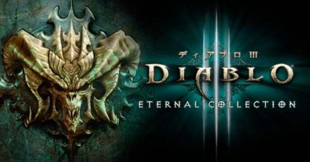

<figure>

</figure>

　PS4/5用の『DIABLO III』が2/2までセールで1,980円ということで買ってしまった。

　『DIABLO III』はその昔PS3で買った覚えがある。あまりやり込まずにそのまま放置。終了となってしまっていたゲームだ。

　未だにアップデートが続いている『DIABLO III』。調べてみるとPC用は2012年発売、PS3用は2014年ということで実に10年も続くロングセラーゲームだったりする。そのときプレイしたいた痕跡が、当時のブログにも書いてあった。

[https://keigox68000.hatenablog.com/entry/20140201/p1](https://keigox68000.hatenablog.com/entry/20140201/p1)

　というわけで、自分にとっては8年ぶりの『DIABLO III』だが、最初に選択できるクラスが増えていたり、4ヶ月毎に新しいストーリーが配信されるアップデートが入っていたり、すっかり様変わりしているようだ。

　ちょっと遊ぶつもりがあっという間に3時間ほど溶けてしまい、『DIABLO』シリーズの恐ろしさにまったく遜色ないところがすごい。そう言えば初代もテレホーダイタイムにオンラインで遊んでいたのを思い出す。

　そんな思い出のある『DIABLO』シリーズだが、10年目の『DIABLO III』もせっかくだからしばらく遊んでみよう。難易度も初代に比べればマイルドで、ソロでも十分に楽しめるので、これからプレイするユーザーにも優しい感じだ。いや、そうやってゲームの入口を広くしておいて、時間泥棒と化すのはよくわかっているのだが。

　とりあえず、ヘヴィに遊んでいる他のゲームとのバランスを取りながらやっていこうと思う。

[https://www.youtube.com/watch?v=AlmWQz2aq1s](https://www.youtube.com/watch?v=AlmWQz2aq1s)
