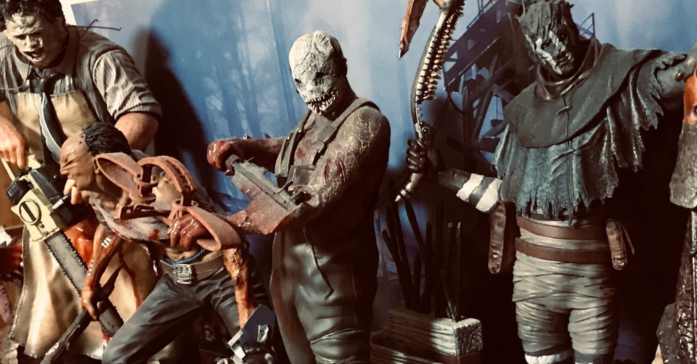

<figure>

</figure>

　いよいよ待ちに待っていたGecco製の三角様とロビーくんが発売になるようだ。

[https://twitter.com/master\_kummo/status/1486536841658793984](https://twitter.com/master_kummo/status/1486536841658793984)

　と言っても、実際の発売は今年の7月。半年先だ。とりあえず予約が開始しているようである。

　以前noteにもfigmaの三角様再販の話や、ロビーくん欲しいなという話を書いた。その願いがようやく叶う日が来そうだ。

[https://note.com/keigox68000/n/n721d1e4a89bf](https://note.com/keigox68000/n/n721d1e4a89bf)

[https://note.com/keigox68000/n/n111ac6cd4ba6](https://note.com/keigox68000/n/n111ac6cd4ba6)

　三角様もロビーくんも1/6スケールということで、飾るとかなりの迫力だろう。少し前にコトブキヤのレザーフェイスを買ったのだが、それと同スケールと考えるとかなりデカい。そろそろ我が家の置き場が無くなりそうな勢いだ。

[https://note.com/keigox68000/n/nacdfb305be98](https://note.com/keigox68000/n/nacdfb305be98)

　実は三角様とロビーくんの両者を購入すると66,800円と若干お高いのだが、もう行くしかないとばかりに予約してしまった。もしかしたら発売が多少先に延びることもあるのかなと思いつつ、半年後が楽しみである。
