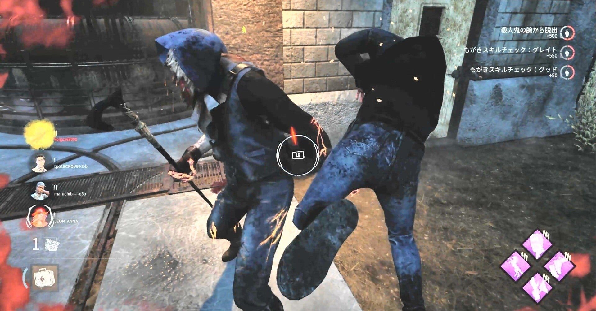

<figure>

</figure>

　『デッドバイデイライト』の話。

　サバイバー用パークの「ボイルオーバー」が強化された。これは、キラーが瀕死のサバイバーを担いでフックまで持っていく際に、通常より激しくもがいて脱出しやすくなるという効果を持つパークだ。

　しかし、実際はあまり強くなくて、ボイルオーバーをつけてもがいても大体はフックに吊られてしまう。ほとんどの人が使っていない役立たずパークだった。

　それが今回のアップデートでパワーアップされ、サバイバーを担いているキラーが高所から飛び降りると、もがきゲージが一気に25％アップして、より脱出しやすくなったのだ。

　このボイルオーバーを、アッシュのパーク「フリップフロップ」と組み合わせると途端に強力な脱出パークとなる。フリップフロップも今までほとんど使われていなかったパークだ。こちらは、サバイバーが瀕死状態のときに回復をしていると、担がれた瞬間に回復ゲージの50％がもがきゲージに変換される。

　サバイバーは故意に、キラーがサバイバーを担いだ際に飛び降りざるを得ない高い場所でやられ、もがきで脱出できる可能性が高いシチュエーションを作る。するとキラーは担ぐのを躊躇するので、今度はそのすきを狙って回復ゲージを貯めておく。サバイバーが這いずりで高いところから落下すると、キラーは今度こそ吊れると思ってサバイバーを担ぐ。しかし、今度はフリップフロップで回復ゲージから変換されたもがきゲージを使って担ぎから脱出する。という作戦が可能になる。

[https://twitter.com/keigox68000/status/1487109182172332034](https://twitter.com/keigox68000/status/1487109182172332034)

　こういう2択はゲームにおいて非常に嫌な状況だが、これによって今までほとんど脱出不可能だったもがきを使って、キラーとの駆け引きが可能になるのだ。

　最近キラーをプレイする人の間では、吊ったサバイバーの近くに常駐する「キャンプ」が流行っていて、それに対する批判をかわそうと、必死で「戦術だ」と言い訳するプレイヤーなども散見されるような状態である。個人的にはキャンプは戦術とは言え、ダイナミズムに欠けるゲーム展開になることは必至であまり楽しいとは言えないと考えている。（これについては少し前にnoteにも書いた）

[https://note.com/keigox68000/n/n9c3eff898483](https://note.com/keigox68000/n/n9c3eff898483)

　しかし、ボイルオーバーが強化されたことで、キャンプに持ち込もうとするキラーに対して、サバイバーにもある程度有効な対抗手段が用意されたと考えることもできる。

　うん。キャンプも戦術、いいじゃないか。サバイバーをプレイする側としてはボイルオーバーも戦術だ。もがきゲージを貯めてどんどんキラーから脱出してやろうじゃないか。カモン！　キャンパー！　いくらでも相手になってやろうじゃないか。

　これからマップを研究して、キラーが吊りにくいポイントを研究していきたい。それから、ボイルオーバーが強化されたことによって、「執念」「ソウルガード」「不滅」「弱音はナシだ」「突破」など、これまで存在感の薄かったいくつかのパークが有効に使える場面が増える可能性がある。それについてもいろいろ試してみたい。がんばろう。

[https://www.youtube.com/watch?v=OlE6DtzcdHU](https://www.youtube.com/watch?v=OlE6DtzcdHU)
