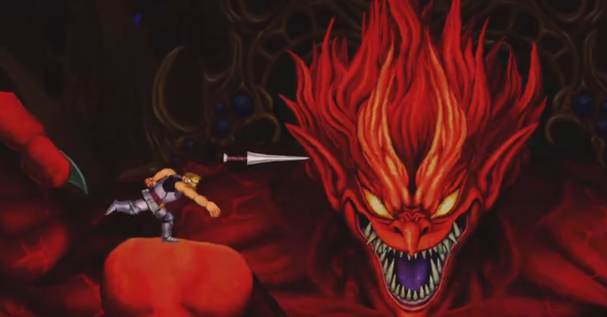

<figure>

</figure>

　旧正月セールで『帰ってきた魔界村』を購入した。

[https://www.youtube.com/watch?v=ggJeZ6XG0lg](https://www.youtube.com/watch?v=ggJeZ6XG0lg)

　前評判は聞いていたが、これがなかなか難しい。最高難易度を選択したのだが、15分もプレイしてギブアップ。最低難易度で遊ぶことにした。

　このゲームは残機の概念がなくクリアするまで無限にチャレンジできるのだが、最低難易度ではさらにその場復活で遊びやすさが増している。

　しかし、それでも難しい。初代『魔界村』並みに操作性の悪いアーサーと、底意地悪い敵配置で容易にはクリアできないようになっている。

　それでも最低難易度ならなんとかクリアはできる。しかし、これは最高難易度（一応最高難易度がデフォルトらしい）でクリアできるのだろうか。そんなことすら思わせる難しさだ。

　レビューを読むと難しすぎる、操作性が悪いという声が一定数あるのだが、まあこの辺りは昔の『魔界村』らしさを狙ったものだろう。こういうターゲットのゲームがあってもいいと思う。

　ゲーム中に、決まった場所で出現する妖精を集めると、それを使用して新しい魔法が使えるシステムは新機軸だと思う。しかし、そのためにもパターンを覚えて妖精を捕まえなければならない。

　しかも、最低難易度では一定レベル以上の魔法は解禁されず、これも高難易度への挑戦を促す仕様となっている。

　正直、しばらく遊んでみて最高難易度でのクリアができるのか自信がなくなったが、とりあえずひとつずつ難易度を上げてクリアしていってみよう。

　ちょっと長い道のりになりそうなゲームである。
