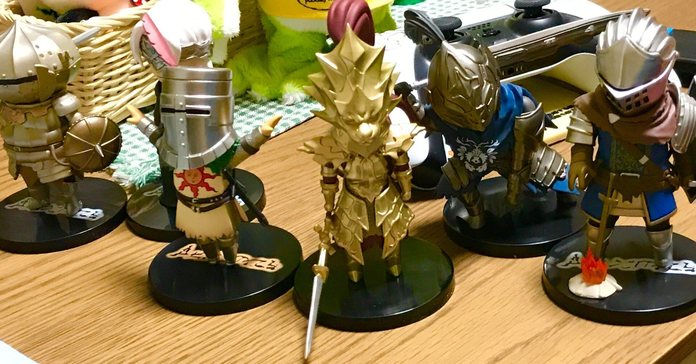
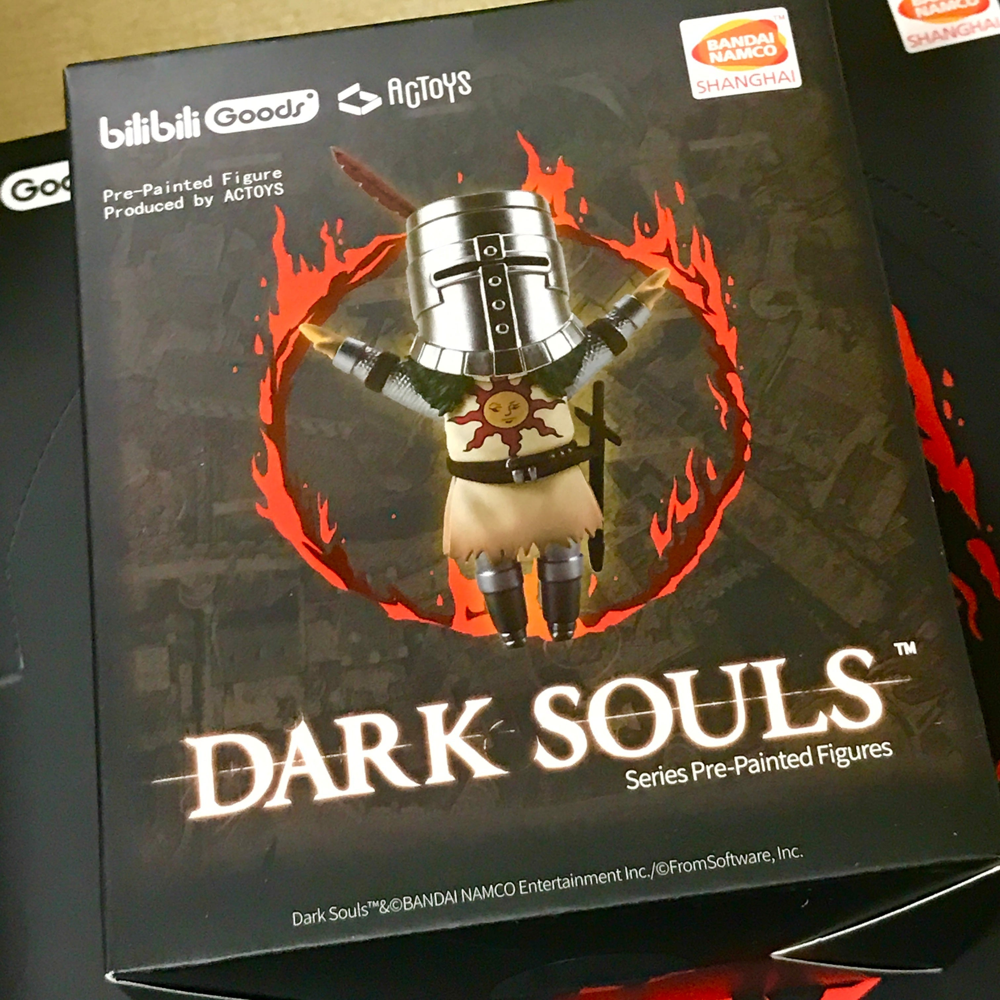
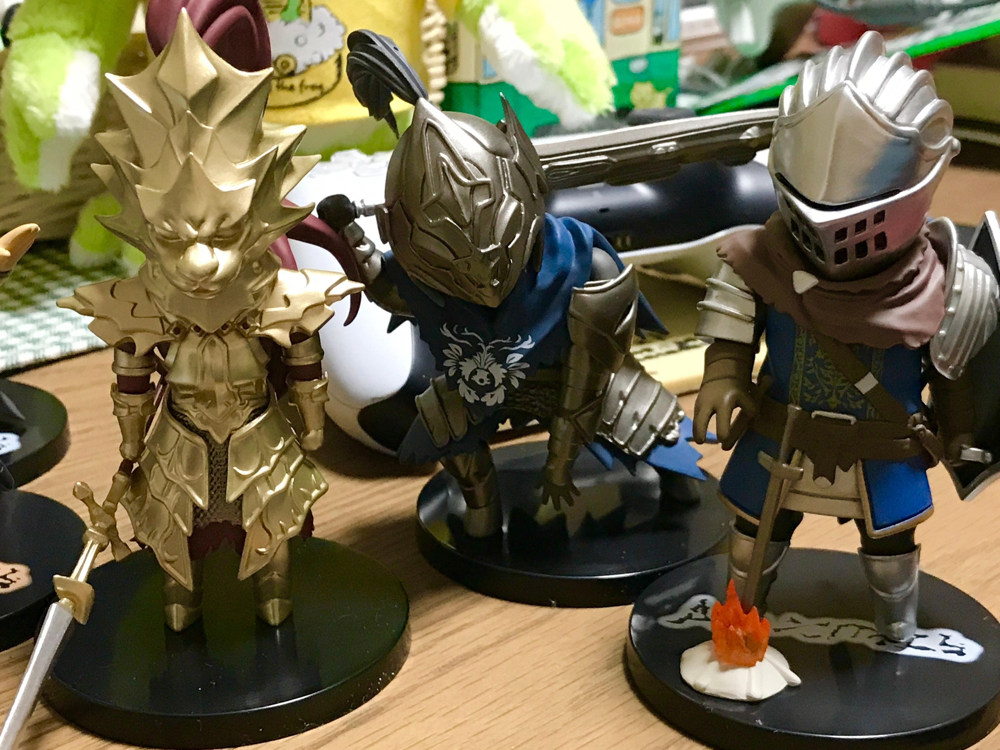
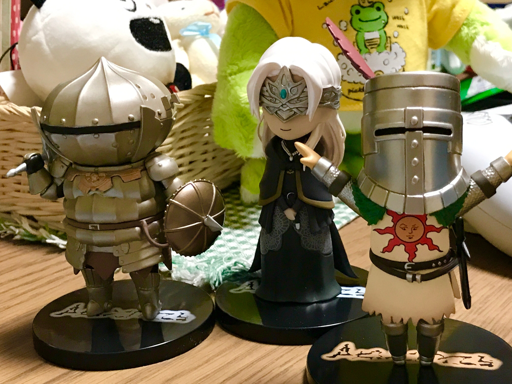

<figure>

</figure>

　ゴミになるだけだからいい年して玩具を買うのはやめよう。と、普段思っているのだがついつい買ってしまう。

　今回はダークソウルのデフォルメキャラクタのフィギュア。もちろんMade in Chinaなのだが、パッケージを見る限り中国語しか書いてない上に『bili bili Goods』なんて書かれているので、どうやら中国向けの製品を輸入して売っているようだ。

<figure>

</figure>

　しかし、最近は中国製もモノがよくなっていて、見た感じ非常によくできている。全6種類のキャラクターは、上級騎士、ジークマイヤー、火防女（III）、オーンスタイン、ソラール、騎士アルトリウスというラインナップだ。

<figure>

<figcaption>

オーンスタイン、騎士アルトリウス、上級騎士

</figcaption>

</figure>

　それぞれの箱にはどのキャラクターが封入されているかはわからないのだが、6体セット箱買いすると全キャラクター揃うというやつだ。国内ではどこのショップでもだいたい10000円前後で売っているので、中国だともっと安いのだろう。

<figure>

<figcaption>

ジークマイヤー、火防女、ソラール

</figcaption>

</figure>

　それにしても、こういう日本の人気ゲームのフィギュアがきちんと日本のメーカーから発売されないのは寂しい限りである。本来なら国内メーカーがゲームの発売に合わせて企画するような商品じゃないか。日本が経済的に後進国になっている様子がこんなところからも伺えて非常に残念だ。

　それはともかく、このフィギュアのシリーズ、実は第2弾が春頃に発売されるらしい。なんだよ、中国の方が圧倒的に勢いがあるじゃないか。第2弾はもう少しマニアックな（？）ラインナップという雰囲気で、そちらも今から楽しみな感じである。
