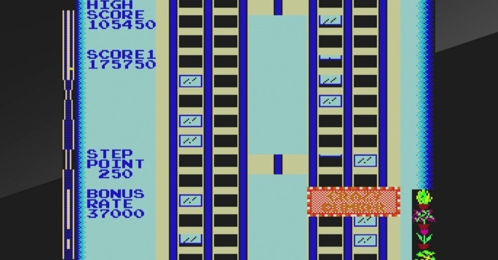
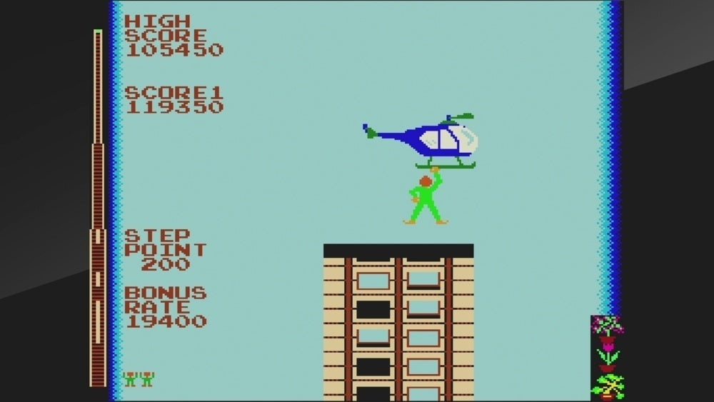
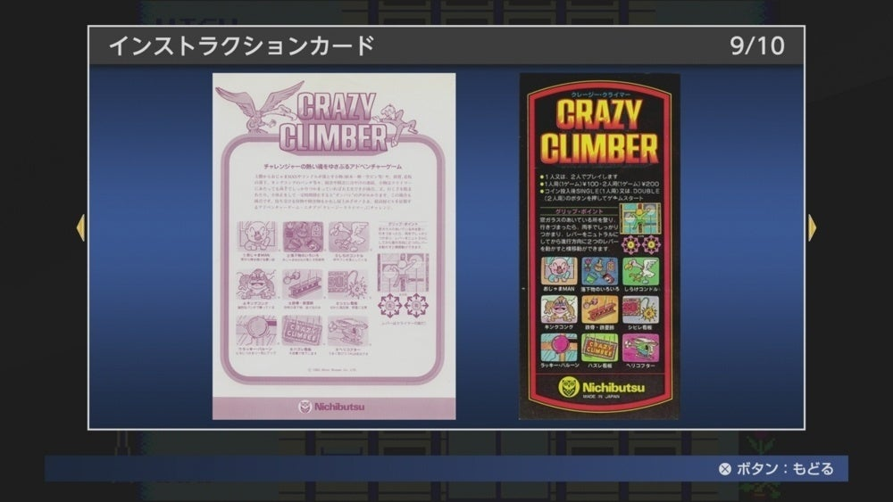
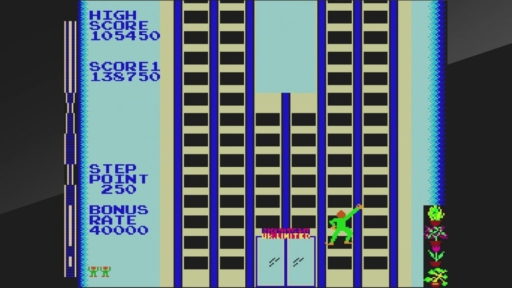
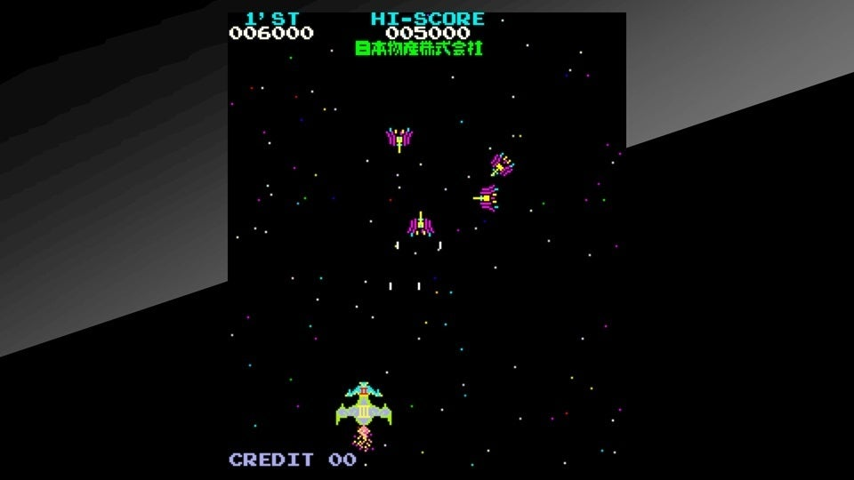

<figure>

</figure>

※この文章は、2016年10月に旧ブログに掲載したものの再掲である

　先日、生まれて初めて『クレイジークライマー』で１周できた。（このゲームは１周は４面構成）

<figure>

</figure>

　小学生の頃、ホームグラウンドゲーセンだったイトーヨーカドーには、いわゆる駄菓子屋筐体がずらっと並べられていた。一様に黒かったテーブル筐体とは異なる、そのカラフルなペンキに彩られた姿を見ると、なぜか子どもらしいワクワク感を覚えたものである。

　当時、そんな駄菓子屋筐体の中で、レバー２本だけがついている、要するにシューティングゲームのようなボタンが、一切ついていない筐体が印象的に目を引いたのを今でも覚えている。それが、『クレイジークライマー』との出会いであった。

　しかし、このレバー２本のみという操作が曲者だった。今思うと、人間が腕だけでビルを登るという、まさにクレイジーな動作をシンプルにゲーム化した操作系統が実に素晴らしいのだが、最初はとにかく思うようにビルに登れない。いや、それどころか、レバーを動かしても動かしても、画面の中の棒人間は、手足をバタバタさせるだけで一向にビルを登ろうとはしないのだ。

　おい、お前はこのビルを制覇するんじゃないのか？上に登らなければ、ビルの屋上にはたどり着かないんだぞ？

　そう言って棒人間を応援したくなるぐらい自由が効かない。そうこうしているうちに、プレイヤーのつかまっている窓がしまり、文字通りつかみ所を無くした棒人間は、哀れ画面外へ落下していくのである。ここで、やっとインストカードを読んでみる。

　「窓ガラスのあいている所を登り、行きづまったら、両手でしっかりつかまり、レバーをニュトラル（原文ママ）にしてから進行方向に２つのレバーを動かすと横移動できます。」

<figure>

</figure>

　いや、「横移動できます」じゃなくて、まずは登り方を教えて頂きたい。この極めて不親切な説明。とっつきにくい操作感。このゲームは難物だ……子どもごころにそう思ったものである。

　しかし、ほどなく（ゲームを数回プレイすれば）レバーを上に上げれば腕を上げる、レバーを下に下げれば腕を下げる、という基本的な動きがわかってくる。右レバーで右腕を動かし、左レバーで左腕を動かすということがわかってくる。そして、手が窓の空いているところにあると、つまり、我々現実世界の感覚で言うと、窓枠をつかんでいると、そこを支点にレバーを下に下げたときに体を上に運ぶことができることに気づくのである。さらに、この動作を左右のレバーで交互に行うと…右、左、右、左……おお！あんなに頼りなかった棒人間が、実にリズミカルにビルを登っているではないか。

　『クレイジークライマー』というゲームにおける基本的な動作を習得し、体と頭で納得して棒人間ことプレイヤーキャラクターを自由に動かせるようになる瞬間である。ここまでたどり着いて、やっとこのゲームはスタート地点に立ったと言えるのだ。

<figure>

</figure>

　　我々は、例えば楽器を演奏する際に、ーピアノでもギターでもリコーダーでも、なんでもいいー　どの音階がどの操作で奏でられるかを頭で考えて覚えようとする。やがてその操作が体に馴染み、熟練者では楽譜を見ただけで、あるいは音を聞いただけで自然と体が動くようになることを知っている。人によってはそれを自分で経験していることだろう。いわゆる「体で覚える」という状態である。

　ゲームには、こうした『体で覚える』要素が随所にあり、決して頭で理解するだけでなく、体が自然に動くようになるところに気持ちよさ、プレイして楽しい状態がある。それは、バスケットボールのゴールにシュートが決まる瞬間の楽しさ、楽譜を見なくてもメロディ通りに楽器が演奏できる楽しさ、そういうものに似た快感であることは、マニアックなゲーマーならずとも理解できるところだ。

　ゲームニクス理論の研究者サイトウ・アキヒロ氏は、ゲームには『心地よい操作感』が必要だと述べている。\*1　『クレイジークライマー』が、（当時はそういう概念は無かったであろうが）ゲームニクス理論的なものを意図して２本レバーの操作系を採用したかどうかは不明であるが、いずれにしても、プレイヤーキャラクターを自由に操作できるようになることの心地よさがそこには存在しているのである。

　　ところで、この『クレイジークライマー』は、ご存知の通り日本物産ことニチブツのゲームであるが、当時のニチブツがこのような、操作系におけるパラダイムシフトを実現したことには驚きを隠せない。

　というのも、その頃ニチブツが世に送り出していたゲームが、ブロック崩しのコピーである『テーブルアタッカー』、『サーカス（エキシディ）』のコピーである『ボンパ』、『スペースインベーダー（タイトー）』のコピーである『ムーンベース』、そして『ギャラクシアン（ナムコ）』のコピーと、自社で開発したゲームが見当たらないからである。

　今の時代からすると、これではコピーゲームを世に送り出す悪徳メーカーみたいに聞こえるが、当時は許諾を受けて他社のゲームを複製し、販売するという商売が成立しており、ニチブツもそういう複製メーカーの立ち位置にいたのである。もっとも、『ムーンベース』と『ギャラクシアン』については、無許諾だったり、許諾台数以上を売ったりして訴えられているところが、なんとも冴えない話ではあるのだが。\*2

<figure>

</figure>

　とにかく、そんなニチブツが、オリジナルとして開発した『ムーンクレスタ』に続く、第２弾オリジナルタイトルが『クレイジークライマー』だったのだ。

　『ムーンクレスタ』が、多彩な敵やドッキングなど独自要素を取り入れていたとは言え、『ギャラクシアン』的な宇宙戦を描いたシューティングという点でそれまでのビデオゲームの潮流から大きく外れていないオーソドックスなゲームデザインだった。それからすると、『クレイジークライマー』のなんとも独創的な発想なには驚かされる。（余談ではあるが、『ムーンクレスタ』や『クレイジークライマー』で独自路線を築いてその後躍進するニチブツが、やがては脱衣麻雀へと路線変更し、様々な漫画やアニメ、映画などをパロディ化したテーマとキャラクターを次々に投入することになるのはなんとも皮肉な流れである）

　話がそれたが、ニチブツのシンギュラリティとも言える『クレイジークライマー』においては、前述したとおり、２本のレバーがプレイヤーキャラクターの２本の腕に接続されたゲームデザインが為されているがゆえに、我々はより「体で覚える」ことを強制されるし、そこには自分の体を使ってプレイ感覚を体得し、上達していく、というゲームの身体性とでも言うべき要素が色濃く表れているのである。後年我々は、格闘ゲームや音ゲーの出現で、よりゲームの身体性を強く意識させられることになるのだが、そのプリミティブな形が『クレイジークライマー』には存在するのだ。

　※ちなみに、『クレイジークライマー』は、ニチブツの開発ではなく、乗換案内でおなじみのジョルダン株式会社の開発であることが、ジョルダン社のサイトで確認されている。

\*1:サイトウ・アキヒロ(2007)『ゲームニクスとは何か』幻冬舎.

\*2:赤木真澄(2005)『それは『ポン』から始まった』アミューズメント通信社.
