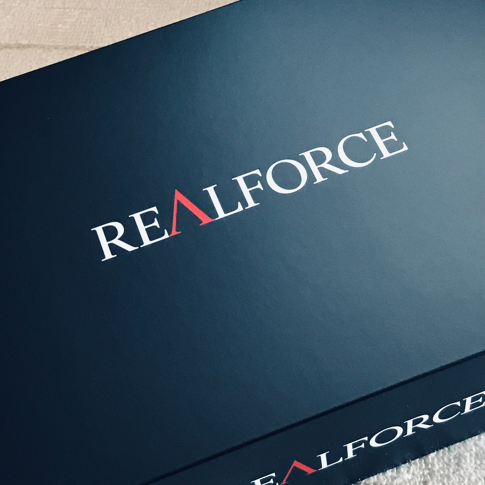

<figure>

</figure>

　以前10年以上使っているREALFORCEの話を書いた。

[https://note.com/keigox68000/n/n74f057e26d30](https://note.com/keigox68000/n/n74f057e26d30)

　そのときに新しいキーボードを買ってみるのもいいかもしれないというようなことを書いたのだが、いよいよ新しいキーボードを買ってみた。なんのことはない。またREALFORCEを買った。

　今回は、リビングに置いてあるPCに接続しているキーボード、マウス、コントローラー、ヘッドホンすべてを無線にするという目論見からキーボードも新調することにした。

<figure>

</figure>

　去年新モデルの『R3』が登場したREALFORCEだが、これはUSB接続とBluetooth接続の両対応になっている。しかし、しばらくの間日本語配列のしかランナップされておらず、買うのをあきらめた。今回、英語配列が登場したので即購入することにしたというわけだ。

　英語配列を選択すると、自動的に静音キーボードになる。別に静音である必要はないのだが、使ってみると以前から使っているREALFORCEに比べて圧倒的に静かだ。

<figure>

</figure>

　しかも、REALFORCE特有のスコスコと心地よく文字を打てる感触は変わっておらず、お気に入りの45g荷重で快適に文字入力ができる。

　実は、しばらくの間HHKBの無刻印キーボードを使っていたのだが、こちらとCTRL、CapsLock、バックスペースなどの場所が違っているので、最初の数時間は打ち間違いが多かった。しかし、それも1日使っていただけで慣れた。

[https://note.com/keigox68000/n/n0e1c9db581a2](https://note.com/keigox68000/n/n0e1c9db581a2)

　Bluetoothの安定度も心配していたのだが、遅延も切断もなく実に好調に動作している。昔買ったREALFORCEと比べて倍以上の値段になっているが、満足度は高かった。

　このキーボードは別に仕事をするためでもなんでもないキーボードだが、むしろ日々趣味や遊びのために使うものだからこそ不快な思いをしたくない。十分に効果のある投資だろう。個人的には、むしろもうほかのキーボードは使いたくないのでREALFORCE一択だったということか。

　また長い間お世話になりそうなキーボードである。
