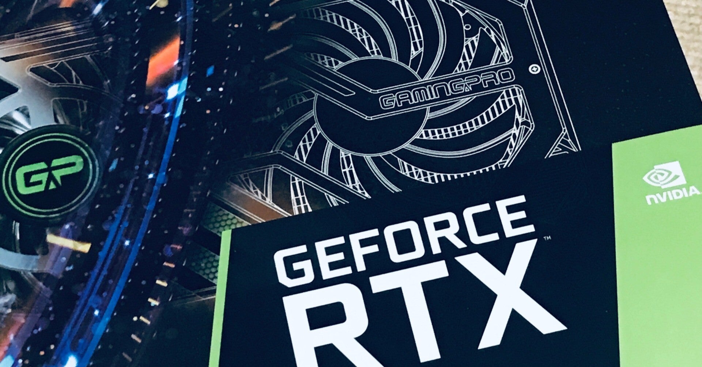

<figure>

</figure>

　もう1年ぐらい前からグラボを新調したいという話をしていたが、ついに新しいグラボを買った。

[https://note.com/keigox68000/n/nc1e33b6f62be](https://note.com/keigox68000/n/nc1e33b6f62be)

　当初ねらっていたRTX2070 Superはもう市場から姿を消してしまったので、RTX3070Tiを買った。当初の予定からするとスペックも価格もかなり高くなったが、結果的に納得のいく性能を手に入れることができた。

　特に、いつも遊んでいる『デッドバイデイライト』が一気に4K解像度で最高画質、それでいて常に60FPSという素晴らしい環境で遊べるようになったのは大きい。かねてからモニターを4Kにしてあったのだが、ついにそれがフル活用されるようになったというわけだ。

　人間不思議なもので、今までフルHDでこれ以上の画質は必要ないと思いこんでいたのが、4Kの解像度を目の当たりにするとまったくの別世界のように感じられる。それだけでも満足感が満たされ、豊かな気持ちでゲームができるというものだ。

[https://www.youtube.com/watch?v=HnclNU-jmfk](https://www.youtube.com/watch?v=HnclNU-jmfk)
