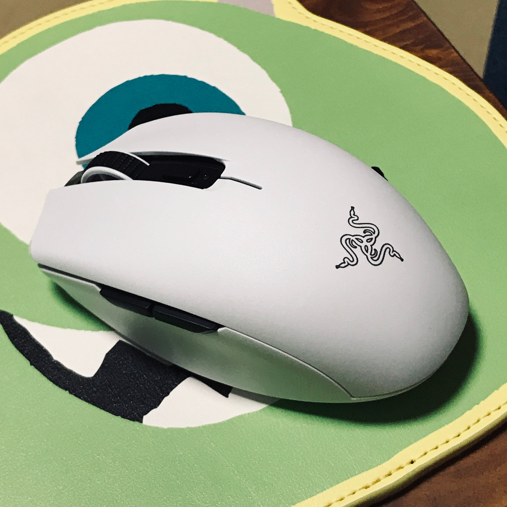
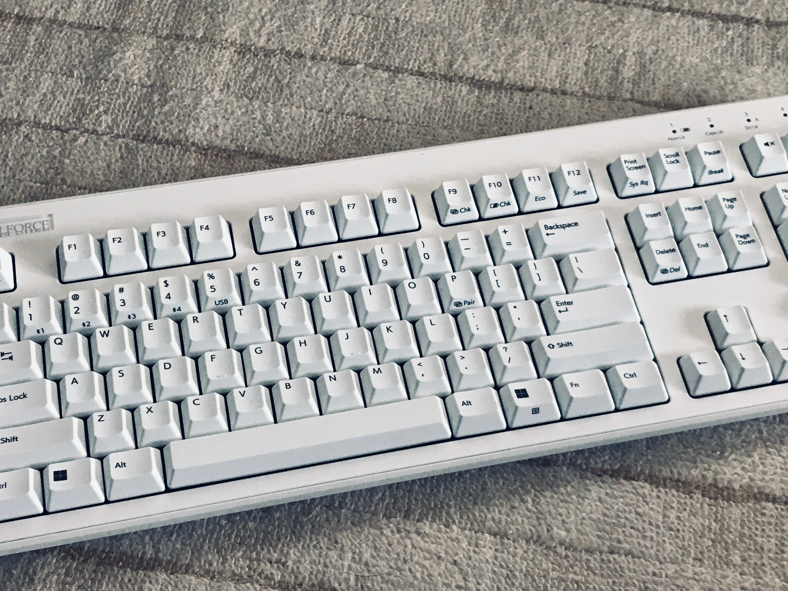

　先日REALFORCE R3を買った話を書いた。

[https://note.com/keigox68000/n/nf9321fe79952](https://note.com/keigox68000/n/nf9321fe79952)

　このキーボードはBluetooth対応なのだが、実はこれにあわせてその他のデバイスもBluetooth接続で無線化してみた。

　まずはマウスをRazer DeathAdder Eliteから、Razer Orochi V2に変更。無線なので光らなくなったが、シンプルで使いやすいマウスだ。2.4GHzの高速ワイヤレスとBluetoothの両対応だが、とりあえずBluetoothで使っている。特に問題ないようだ。

<figure>

</figure>

　ゲーム中に使うヘッドホンも無線化した。ゲオで安く売っていたGRFD-SWE300T8Sを使っているが、これは低遅延モードを搭載していてゲーム中にも違和感なく使うことができる。

<figure>

</figure>

　それと、やはりゲームに使うコントローラーはこれまでXbox360の有線コントローラーを使っていたが、Bluetooth対応のものということで、以前PCゲーム用に使っていたデュアルショック4に戻してみた。

　特にキーボードとマウスについては、ゲームをプレイする際にはBluetoothでは遅延が大きいということを聞くが、普段PCのゲームもあまりキーボード＆マウスで遊んでないので困ることはない。文字を入力するときも遅延を感じることはないようだ。

　この無線化したPCはリビングで使用している。いろいろ工夫してケーブルを隠してはいたのだが、それでもどこかでケーブルがごちゃごちゃしてしまっていた。Bluetoothで無線化したことで、そのごちゃごちゃから解放されてすごくすっきりした。無線化の効果は大きい。（ちょっとお金かかったけど）

<figure>

</figure>
