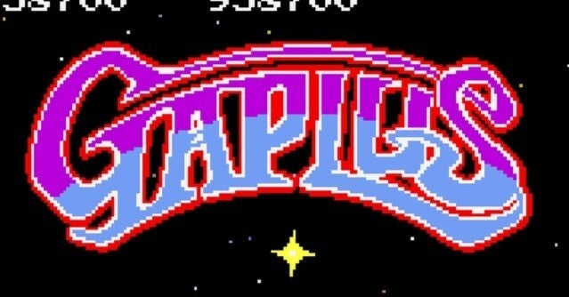

<figure>

</figure>

　アーケードアーカイブスで『ギャプラス』が配信となった。ここのところアーケードアーカイブスはナムコに力を入れていて、初移植のもの、ファンとして嬉しいマニアックなものなどラインナップが非常に熱いのだ。

　『ギャプラス』については、以前ゲームセンターで100円返すからやめてねと言われた話を書いた。

[https://note.com/keigox68000/n/n17e296fc1987](https://note.com/keigox68000/n/n17e296fc1987)

　で、今回久々にプレイしてみて、改めてその面白さを再確認できた気がする。敵の動きが速く、高次面ではかなりの難易度のゲームである上に、PS5のコントローラーでプレイ、なおかつ液晶モニターという取り合わせを考えると、大して先のステージには進めないだろうと思っていた。

　ところが、いざ始めてみるとやっぱりスペシャルフラッグの存在が大きく、思ったより長時間プレイとなった。100万点には届かなかったものの、90万点超えで1時間ほど遊んでいた。これでは当時のゲームセンターはたまったものではないだろう。100円渡されて「帰ってくれ」と言われるわけだ。

　しかし久々に遊ぶ『ギャプラス』はやっぱり刺激的だし、過剰なスピード感もゲーマーの本能を呼び覚ますような心地がする。状況が限定されたパワーアップも緊張感と戦略性を生み、絶妙なやりごたえを感じさせてくれる。本物のゲームは時間が経っても輝きを失わない。

　ちなみに昨夜の時点では暫定ランキング1位だったが、今日見てみるとすでに3位になっていた。週末にはきっとカンストのツワモノが現れていることだろう。さて、僕も週末にはちょっとがんばってみることにしようか。

[https://www.youtube.com/watch?v=YRCwS\_ZiavA](https://www.youtube.com/watch?v=YRCwS_ZiavA)
