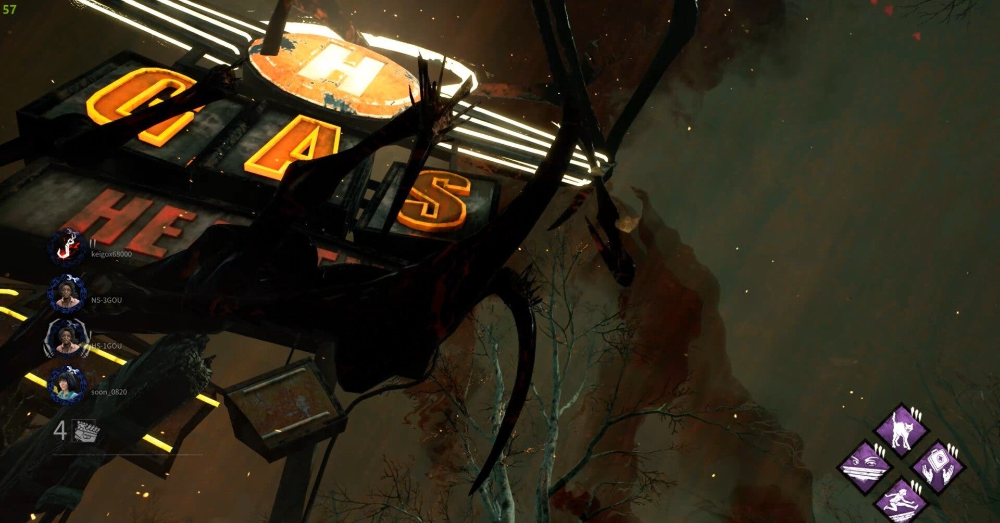
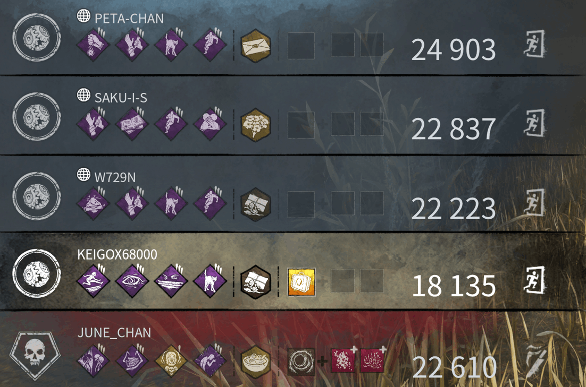

<figure>

</figure>

　『デッドバイデイライト』では、プレイヤーの腕前を評価するランクシステムが搭載されている。現在ではどちらかといえばやり込めば上がっていく感じで、あまり腕前を表している感じでもないが。

　以前は、このランクを使ってプレイヤー同士をマッチングさせていた。しかし多様なプレイヤーの流入でそのマッチングの公平性が疑わしくなり、ランクでマッチングするシステムは、内部的にプレイヤーの腕前を評価した数値をもとにマッチングするスキルレーティングに置き換えられた。

[https://note.com/keigox68000/n/n80d984f54935](https://note.com/keigox68000/n/n80d984f54935)

　このシステムも遊んでいる感触だと適性にスキルを判定しているとは思えない。むしろ数値を見えなくしてクレームをつけにくくするのが目的だったんじゃないかと勘ぐってしまう。

　僕自身はゲーム内の数値はできるだけプレイヤーに開放してくれる方が攻略の手応えが感じられて嬉しいのだが、『デッドバイデイライト』はオンラインゲームであるためか、運営は数値を隠したいようである。

　そしてその運営、なんと今度はゲーム終了時に表示されるプレイヤーのグレードも隠してしまった！

<figure>

</figure>

　これでは、スキルレーティングが適性に動いているか動いていないかの憶測すらできない。どうやらこのゲーム、何から何まで隠してしまいたいようだ。そんなにプレイヤーから文句を言われたくないのだろうか。

　『デッドバイデイライト』もそろそろ6周年。個人的には楽しく遊んでいるが、そろそろゲームとして寿命を迎える頃に来ているのかもしれない。あとは何も見えなくともワイワイと楽しめる人たちで混沌と遊んでくれということかもしれない。

[https://www.youtube.com/watch?v=pdbx4jDvyDA](https://www.youtube.com/watch?v=pdbx4jDvyDA)
