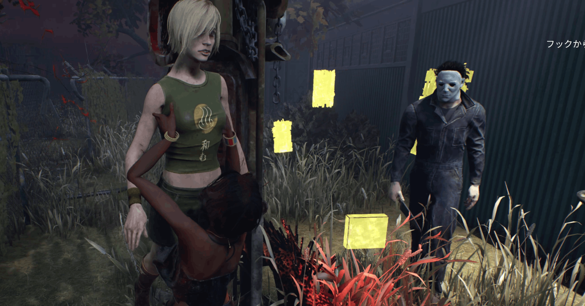

<figure>

</figure>

　最近また『デッドバイデイライト』をプレイする人口が増えたようだ。ファンとしては嬉しい限りである。

　などと真っ当なことが書けないぐらい、実はこれがひどい状況を呈している。何がって、サバイバーをフックに吊るしたらそこから離れないで確実に一人を葬り去るキャンパーが爆発的に増えているからだ。

　僕はキャンプをしても、キラーの前で屈伸する煽りと呼ばれている行為も、ゲームのシステム的に可能な動作で、なおかつ公式からストップがかかっていないものは何でもやっていいと思っている。

　しかしながら、キャンプ行為が増えると、さすがにそこに当たってしまったサバイバーは不幸である。わずか数分のゲーム時間ではあるが、何もせずにただ吊られてゲームオーバーまで待つだけ。これはつまらない。

　もちろんゲームであるから、敵であるプレイヤーに気を使ってわざと不利な行動を取る必要はないのだが、キャンプはやっぱりつまらないので、僕はキラーをプレイする際にはできる限り避ける。やっている自分もおもしろくないからだ。

　ところが、新規プレイヤーが増えた今、状況は変わりつつある。彼らの多くはゲーム配信の『デッドバイデイライト』を見てやってきた者たちだ。有名配信者がかっこよくチェイスを決め、サバイバーを一人残らず闇に葬り去る動画を見て、自分も同じことをやりたいと思ってゲームに臨んでいる。

　しかし、一朝一夕にゲームが上達するわけではない。ほとんどの場合、サバイバーに逃げられて終了である。しかし、新規にゲームを始めた若者たちはプライドだけは根拠なく高い。よって、簡単にサバイバーを葬ることができるキャンプをする。

　しかし、キャンプをすると少なからず批判の声にさらされる。ゲームのプレイを動画として配信しているならなおさらだ。そこでプライドの高い彼らは「キャンプは戦術です！」という判で押したような理論武装を始める。ゲームには勝ちたいが、そのプレイスタイルを批判されることは彼らのプライドが許さないのだ。自分はかっこいい配信者の仲間の一人なのだ。

　一方で、サバイバーがしゃがみボタンを連続して押すことで屈伸しているようにみえる動作を「煽り」として嫌う。その動きが何を表すのかはわからないが、多くのプレイヤーにとって、その動きは自分をバカにした行為と映るようだ。

　その「煽り」と捉える心理は彼らの自身の心の中にあるわけだが、彼らはそのような納得はできない。何と言っても一流配信者としてのプライドがあるから、煽りは悪として断罪しなければ気が済まないのだ。いや、一流配信者様である自分をバカにするなんて絶対に許されない。フォロワー/登録者という名の取り巻きを伴って、皆で断罪するしかないのだ。

　かくして「キャンプは戦術、煽りは悪」という自分オリジナルの理屈の完成である。でもそれって、単なるあなたのお気持ちでしかないんだけどね。

　嗚呼、『デッドバイデイライト』よ、お前はどこへ向かっていくのか。
