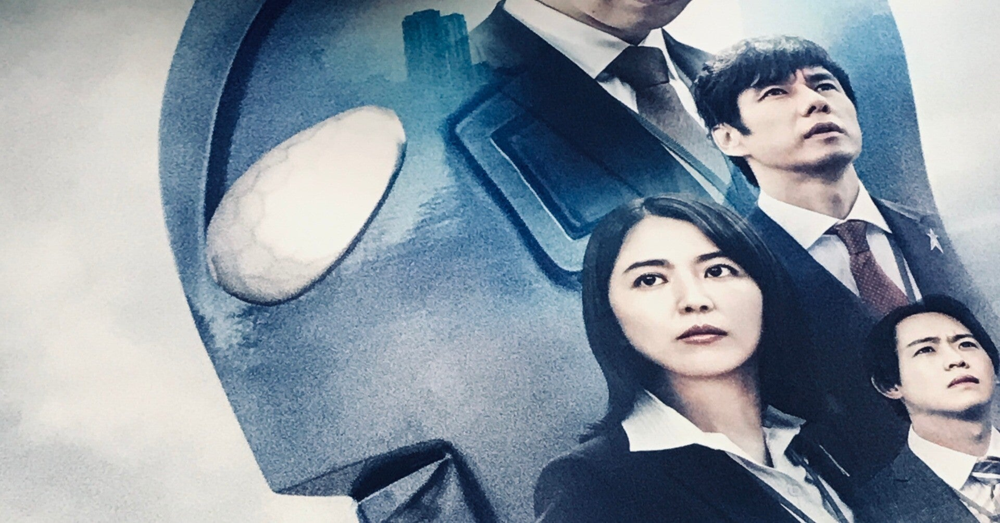

<figure>

</figure>

　正直大丈夫なのかなという気持ちで見に行った『シン・ウルトラマン』だが、結論としておもしろかった。あとはネタバレなく思ったことを簡単に記しておく。ネタバレ無しなので中身薄いが。

　よくも悪くも、期待を裏切らず、予想の範囲内に収まった出来。映画全体のテイストから、CGをメインにした画作り、演出の雰囲気まで、特に『シン・ゴジラ』を見ていれば「ああ、こうなるよね」という納得感。サプライズはない。

　劇中に思ったよりもたっぷりと宮内國郎の曲を使用していたのは好印象。やっぱりこういうのは大事。すごく盛り上がる。

　当然ファンが期待しているであろう小ネタは山盛り。昔のウルトラマンを見ていれば見ているほどわかるネタが目一杯詰め込まれている。しかし、こういうオタク的な楽しみはそういうのが好きな人向けであって、やっぱり自分はオタクになりきれないことを思い知らされる。オタクの喜びそうな小ネタ、別に嫌味に感じる要素ではないが、そういう枝葉末節を楽しむような年齢はとうの昔に通り過ぎていたようだ。

　あとは、映画ならではの大きな画面を生かしたスケールの大きい描写は見応えがあるが、逆にCGには意外と迫力がない。これは『シン・ウルトラマン』という作品のCGがダメということではなく、そろそろ我々がCGに慣れてきてしまっているせいもあるだろう。個人的にはテレビシリーズでやっているきぐるみとミニチュアによる手作り感満載の映像の方が好みなのかもしれない。いや、これは最近のテレビシリーズがそれだけがんばっているということか。

　最後に。ダイコンフィルム時代からそう感じていたが、庵野秀明の脚本が辛気臭い。これは彼の持ち味でそこがファンに歓迎されている部分なのでまったくの好みの問題だが、自分としてはもうこういうのはいいかな、という印象を受ける。いわゆる中二病みたいなものがずーっと抜けずに大人になった感は否めない。でもこういうのが受け入れられる素地があるのだから、それはそれでいいのだろう。最近のテレビシリーズのように、絶望的な危機なのに明るくパワフルに乗り切る子供番組のノリの方が心地よく感じてしまった。

　というわけで、総じて『シン・ウルトラマン』はオタクのためのウルトラマンリメイク作品という印象だ。ただそれは、作品の方向性、持ち味であって、いいとか悪いとかいうはなしではないのだろう。

　あ、俺『エヴァンゲリオン』とかも全然きちんと見てないのでそれもついていけない部分があった理由かもな。もう一回見直したい作品ではあった。
