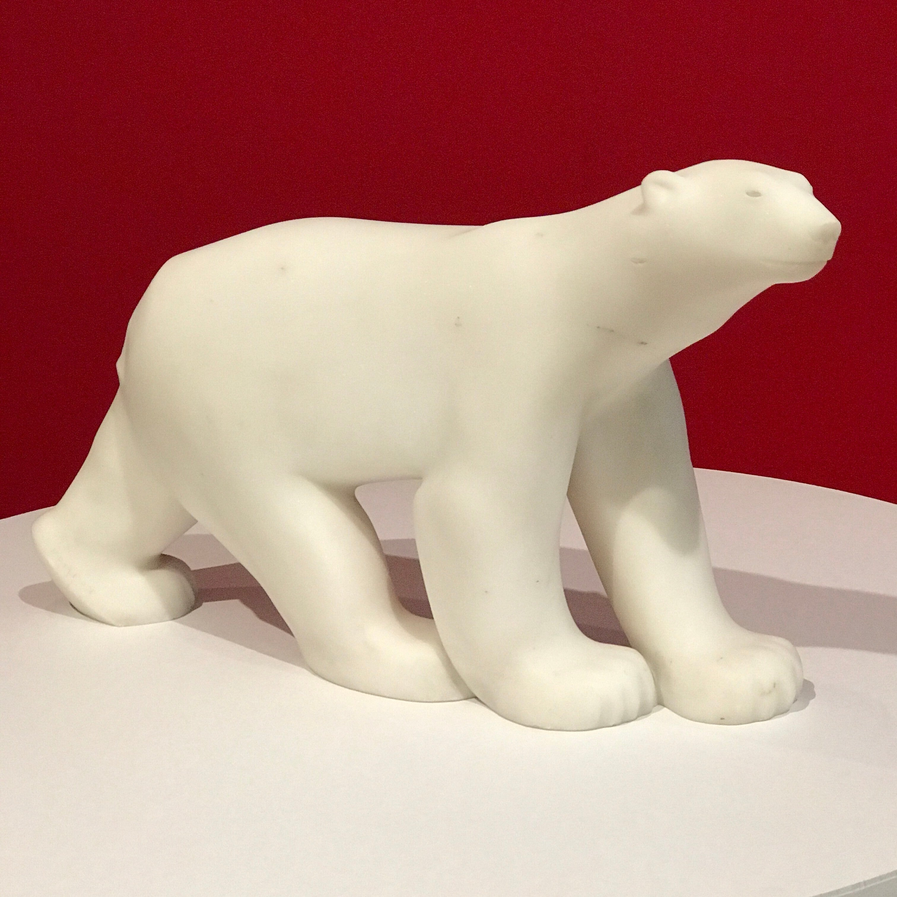
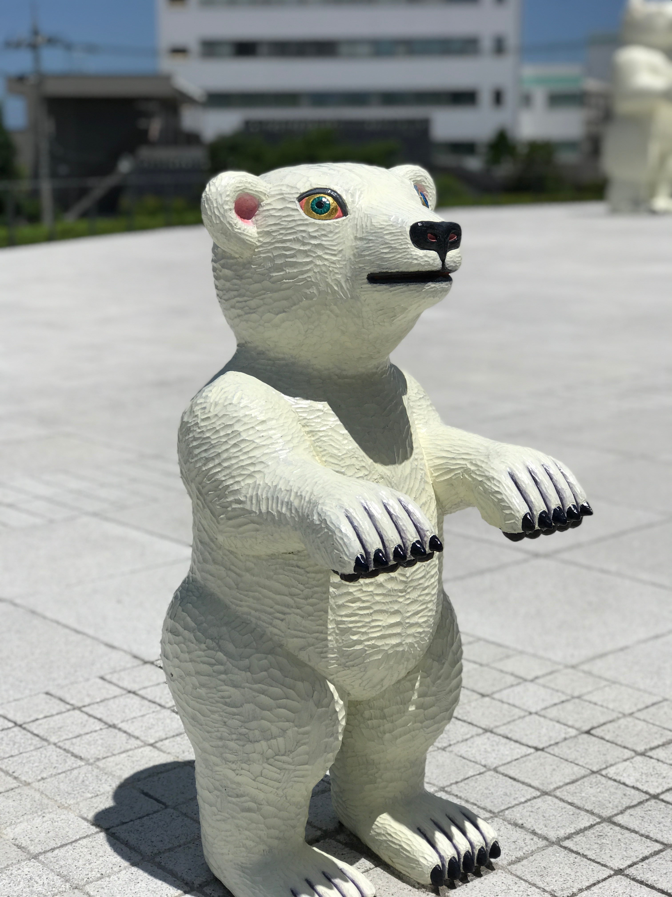
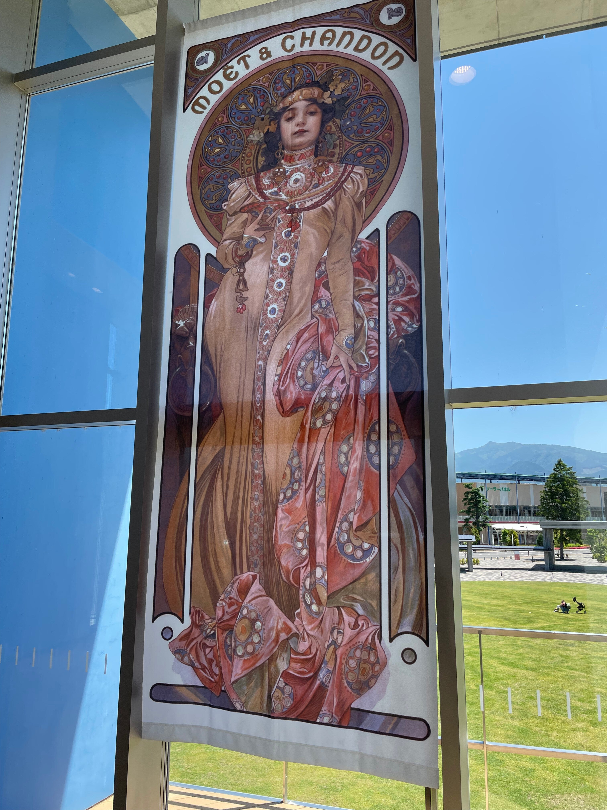
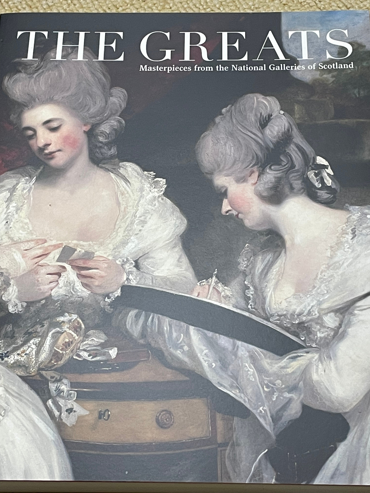
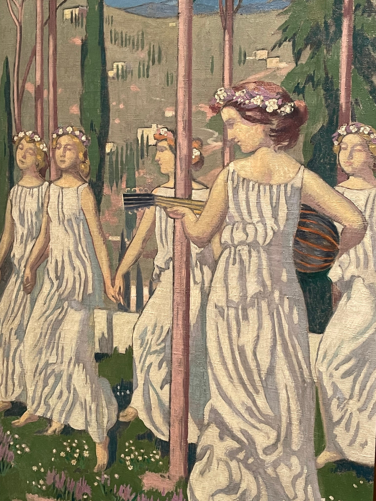
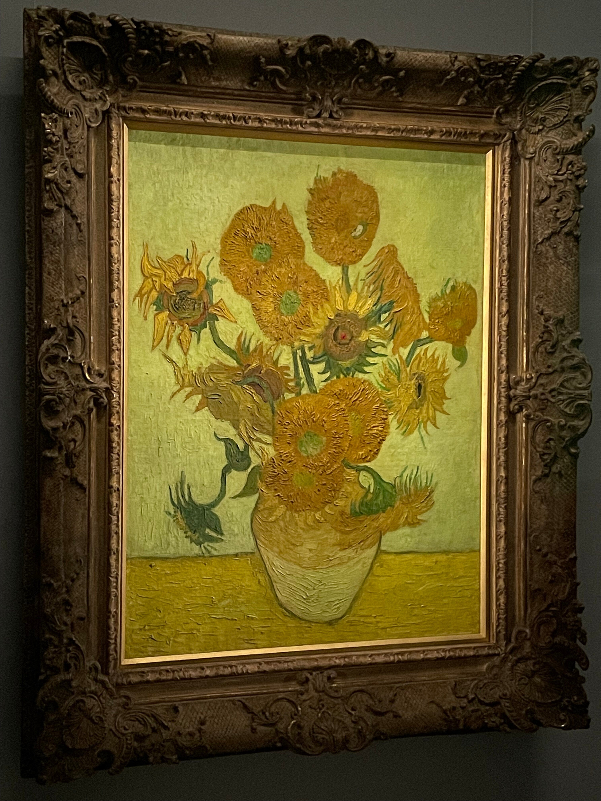

　1月に『今年は美術館へ行きたい』ということを書いた。

[https://note.com/keigox68000/n/n88b1edc0876a](https://note.com/keigox68000/n/n88b1edc0876a)

　ようやく少し出かけられる状況になってきたかなということで早速計画を実行に移している。俺はやる男だぜ。

　5月から6月にかけて結構な展覧会を回った。以前はこんな頻度で美術館へ行っていなかったが、2年間ぐらい美術館からまったく遠ざかっていた反動みたいなものだ。

　以下、最近行った展覧会を列記。（すでに終了した展覧会もあります）

### 山梨県立美術館『フランソワ・ポンポン展 動物を愛した彫刻家』

フランソワ・ポンポンは19世紀から20世紀にかけて活躍していたフランス生まれの彫刻家。特にシロクマをはじめとする動物の彫刻は老若男女を問わず親しみの持てる作風で楽しめる。なお、ポンポンの作品は群馬県立館林美術館に所蔵されていて、会期が終わった後もそちらで楽しめる。  

<figure>

</figure>

### 富山県美術館『富山県美術館開館5周年記念　宮城県美術館所蔵　絵本原画の世界2022』

『ぐりとぐら』や『はじめてのおつかい』など、子どもの頃に見た覚えのある絵本の原画を展示。展覧会だけでなく、今まで行ったことのなかった富山県美術館自体も見てみたかった。

<figure>

</figure>

### サントミューゼ 上田市立美術館『アルフォンス・ミュシャ ー煌めきの女神たちー』

ミュシャ展は散々見に行っている感じはあるが、ご近所の美術館で開催ということで見に行ってきた。

<figure>

</figure>

### 東京都美術館『スコットランド国立美術館　THE GREATS　美の巨匠たち』

スコットランド国立美術館の西洋絵画を集めた展覧会。公式サイトでは、ジョシュア・レノルズ『ウォルドグレイヴ家の貴婦人たち』やディエゴ・ベラスケス『卵を料理する老婆』にスポットを当てて宣伝している。日本人好みの重厚な絵画が多い。ベラスケスの作品は「ぐでたま」とコラボしていて、こういうの楽しい。個人的にはジョン・エヴァレット・ミレイの『古来比類なき甘美な瞳』おすすめ。

<figure>

</figure>

### 国立西洋美術館『国立西洋美術館リニューアルオープン記念 自然と人のダイアローグ フリードリヒ、モネ、ゴッホからリヒターまで』

リニューアル記念の展覧会ということで、印象派から現代アートまで幅広い作品が展示されていて見ごたえある。加えて常設展も見るとかなりのボリューム。

<figure>

</figure>

### SOMPO美術館『最後の印象派、二大巨匠シダネルとマルタン展』

昨年山梨県立美術館でも開催されていた企画展。19世紀末から20世紀前半にかけてフランスを中心に活躍したアンリ・ル・シダネルとアンリ・マルタンという2人の作品を展示。全然知らない人たちだったけど、印象派から連なる独自の画風の美しい作品が楽しめる。あと、SOMPO美術館所有のゴッホの『ひまわり』を見たかったのもあって。

<figure>

</figure>

　これまで知識なく漫然と見ていた西洋絵画だが、最近は少し興味を持って本など読んでみている。いろいろわかると面白いところもあるので、趣味を知識で補完するのは大切である。さらにいろいろ見てみたい。
