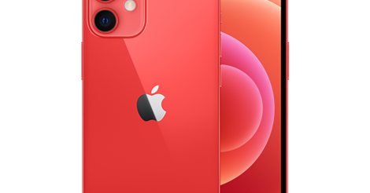

<figure>

</figure>

　少し前にiPhone7がもうダメになってきた話を書いた。

[https://note.com/keigox68000/n/na8599159ec53](https://note.com/keigox68000/n/na8599159ec53)

　結局その半年後にiPhoneは買い替えとなった。バッテリーを交換するといいという話も聞いたが、さすがに高い金を出してバッテリーだけ交換するなら新しいスマホが欲しくなるという気もあって買い替えに至ったのである。

　アップル製品が軒並み値上げされる直前に買ったということで、いいタイミングでの買い替えとなったわけだが、買ったのは1代前のiPhone12 miniである。

　最新機種フルスペックでなくても十分に使えるということ。もうバカみたいにデカいサイズのスマホに嫌気が差していたことがiPhone12 miniを選択した理由だ。

　ちなみにすごい真っ赤なボディのやつを買った。カラーバリエーションが多いのは魅力的だった。

　で、1ヶ月ほど使ってみているが、全然困ることはない。本体のデザインも昔のカチッとしたアウトラインのデザインに戻っていて、個人的にはこれがすごく好みである。

　ちょっと不便と聞いていた顔認識も、マスクをしている状態では認識しないものの、個人的には指紋より便利だ。しばらくは、この小さなスマホでやっていけそうである。

　今やiPhoneもものすごい価格になってしまい、これからは日本人にとっておいそれと買えるようなガジェットではなくなるのかもしれないが、もしかしたらこのiPhone12 miniが最後のアップル製スマホということになるのかもしれない。そんなことを考えながら使っていきたい。
