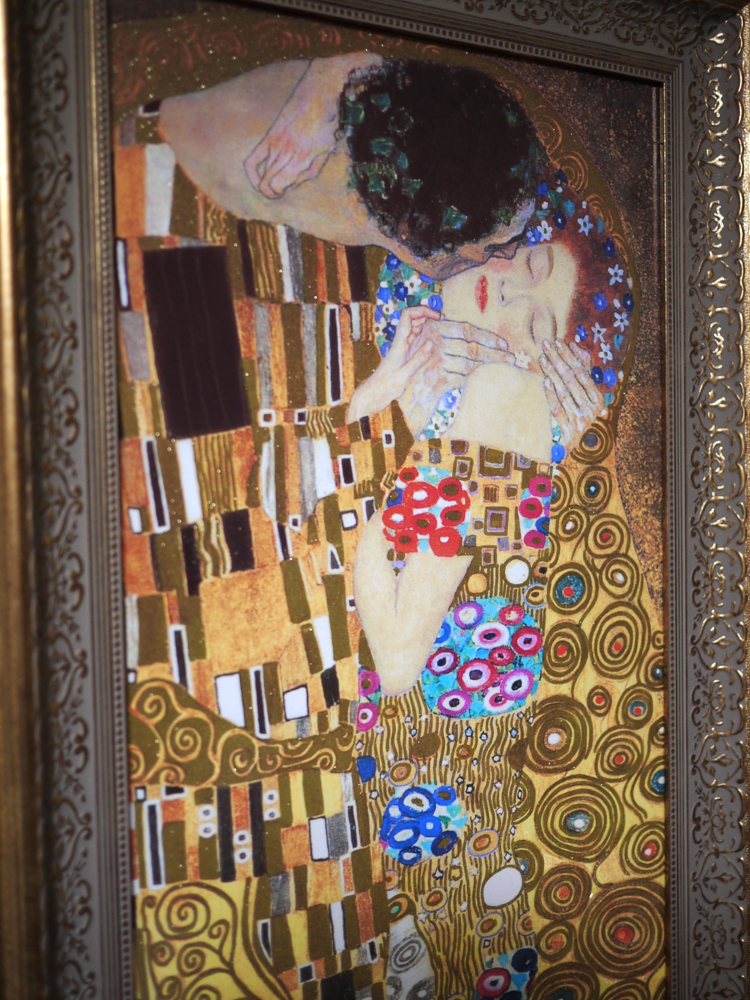
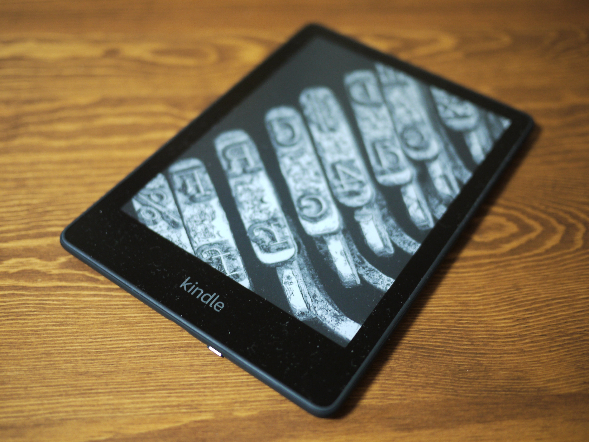
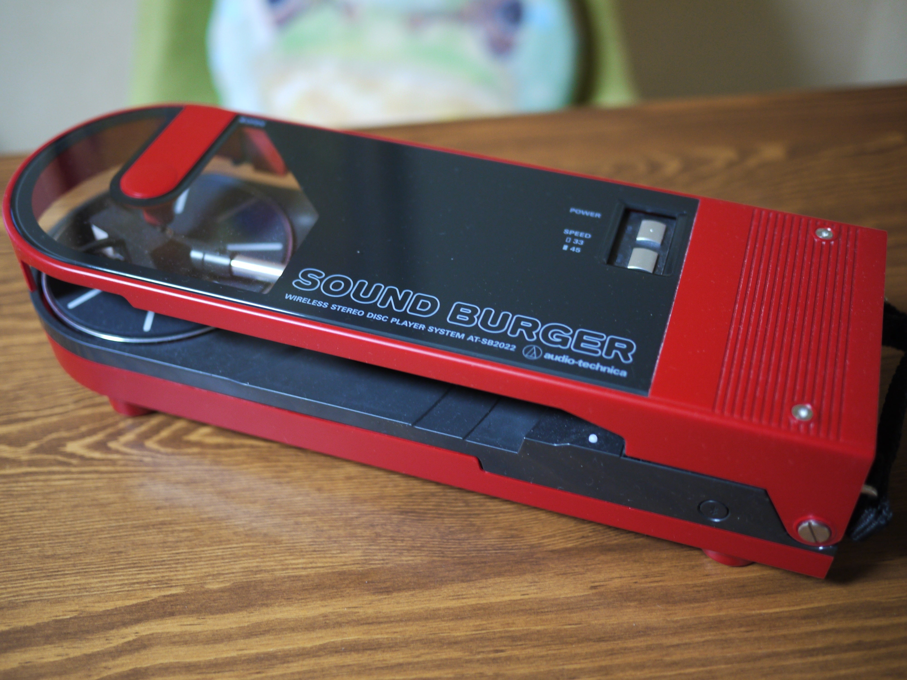
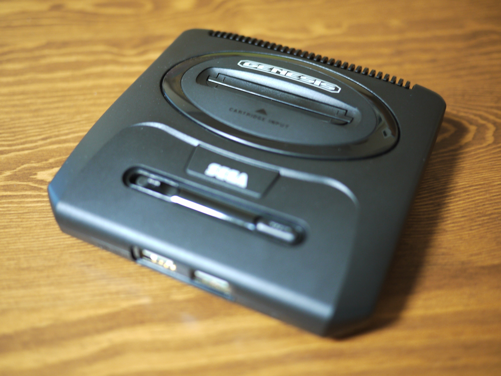

　年の瀬も押し迫ってきて久々にnote。今年は3つほどあげてみたい。

### 第3位　インテリア絵画

<figure>

<figcaption>

クリムト『接吻』

</figcaption>

</figure>

　クリムトの『接吻』のインテリア絵画を買った。縦長にトリミングしてあって、111x46cmと結構大きい。これは模写なので結構本物と違ったり、トリミングのお陰で人物がどこにいるのかとかわからなかったりするんだけど、でもインテリア用に金色が強調してあってピカピカしていて素敵。愛にあふれる表現を見ているとちょっと安らかな気持ちになれるのだ。

### 第2位　Kindle Paperwhite

<figure>

<figcaption>

Kindle Paperwhite

</figcaption>

</figure>

　7,8年前に買ったKindleは防水じゃなかったので、新しく防水Kindleを購入。秋頃に腰を痛めてしまったのだが、それを機会に普段シャワーばかりで済ませていた入浴をきちんと浴槽に浸かるようにした。せっかちな性格でお風呂タイムにも読書できるようにと買ったのだが、これが大当たり。ゆーっくり風呂で30分ほど読書できるようになったら読書が進む進む。ついでに腰もすっかりよくなり、いいことずくめ。クォリティオブライフ爆上がりである。

### 第1位　サウンドバーガー AT-SB2022

<figure>

<figcaption>

サウンドバーガー AT-SB2022

</figcaption>

</figure>

　昔あったレコードをはさんで再生するタイプのプレーヤーが復刻。思わず買ってしまった。レコードプレーヤー自体は流行と関係なく昔から持っているのだが、昭和スタイルの据え置きオーディオからはもう離れて久しく、レコードもあまり聞かなくなってしまっていた。しかし、この新サウンドバーガーはBluetooth対応ということで、再びレコードが活躍できる機会になるかな、と思って買ってみたというわけだ。  
　去年購入したソニーのグラスサウンドスピーカーと併せて使っているが、これが家の中どこでも聞けて便利。おかげで毎日レコードを聞く生活になった。これはレトロとハイテクの合体スタイルという感じで今の時代らしいリスニングスタイルじゃないかと自画自賛してたりして。  
　ちなみに発売直前までこの製品のことを知らなかったのだが、発売日2,3日前にSNSで流れてきた情報を見て発売日当日に購入。どうやら人気商品だったらしく、ショップのサーバが落ちたりして大変だった。運よく買えてよかったよ。

[https://twitter.com/keigox68000/status/1596671907868577792](https://twitter.com/keigox68000/status/1596671907868577792)

[https://note.com/keigox68000/n/nb7a6ad12a5b5](https://note.com/keigox68000/n/nb7a6ad12a5b5)

### 番外編　セガジェネシスミニ２

<figure>

</figure>

　これは当世はやりの○○ミニ。昔のゲームを復刻してまとめて発売するゲーム機だ。日本版のゲーム中心のメガドラミニ２が発売されるという話は聞いていて、でもそちらはあまり遊ぶゲームがなさそうで買わなかったのだが、一部のソフトが海外版に置き換わっているこちらのジェネシスミニ２は遊びたいゲームが入っていたので買ってしまった。買ってからまだ1週間程度だが、結果として毎日遊んでいる。製品としてもよくできていて買ってよかった。

#買ってよかったもの
