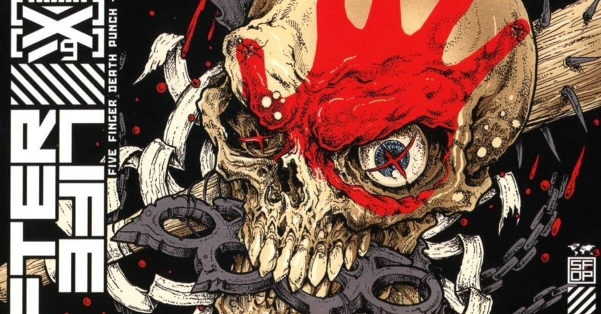

<figure>

</figure>

　今年も1年間のアルバムをまとめよう。いつも30枚ぐらいになっちゃうけど、今回はがんばって10枚に絞ってみた。

### 第10位 THE GOD MACHINE / BLIND GUARDIAN

　久々にメタルなブラインド・ガーディアンが聞けるのは嬉しい。テーマ性に則ったドラマティックとでも言うべきバンドならではの世界観が構築されているのがいい。

[https://open.spotify.com/album/4aoy2NnmDpWvjWi9taOHYe?si=76hIXl2dRSmARIguNfx-hQ](https://open.spotify.com/album/4aoy2NnmDpWvjWi9taOHYe?si=76hIXl2dRSmARIguNfx-hQ)

### 第9位 DOPAMINE / THUNDER

　あれ？サンダーって去年もアルバム出してなかったっけ？というぐらいアクティブな活動っぷりが嬉しい。しかもサウンドが90年代頃にくらべてどんどんハードロックの王道にフォーカスしているのも凄い。

[https://open.spotify.com/album/3M5n3wqXZuX2HyP2sKQU5i?si=MIR6Yi2rS8GTUG1L1kT2RA](https://open.spotify.com/album/3M5n3wqXZuX2HyP2sKQU5i?si=MIR6Yi2rS8GTUG1L1kT2RA)

### 第8位 DIAMOND STAR HALOS / DEF LEPPARD

　デフ・レパードは今回メロディアスでギターサウンドのかっこよさを失わないアルバムを作ってくれた。本当に安心感のある王道ハードロックで素晴らしい。

[https://open.spotify.com/album/5arLkguGPIDSGzCT8Cjt6K?si=WjxvJywzSAKxo-UH6sAVeA](https://open.spotify.com/album/5arLkguGPIDSGzCT8Cjt6K?si=WjxvJywzSAKxo-UH6sAVeA)

### 第7位 ØF KINGDØM AND CRØWN / MACHINE HEAD

　ヘヴィで哀愁に満ちたメロディは鬱屈とした世界を映し出す鏡のようなサウンド。ソリッドなリズムで繰り出されるブルータルは切れ味鋭く心地よい。

[https://open.spotify.com/album/6duwuU8xgK7ShKMCrUxfBi?si=13b7IORUQomI\_ZVimoFIKg](https://open.spotify.com/album/6duwuU8xgK7ShKMCrUxfBi?si=13b7IORUQomI_ZVimoFIKg)

### 第6位 DIGITAL NOISE ALLIANCE / QUEENSRŸCHE

　クイーンズライクは90年代以降バンドが消えてなくなってしまうのではないかという迷走ぶりだったが、ここ10年ぐらいは安定して迷いのないアルバムを作っている。今作はメタルバンドとしてのクールさを体現した名盤になっている。

[https://open.spotify.com/album/0AjjVxJ8KkGrrRImHUlC3r?si=wNWWii5uQNWD0h3e3utvgQ](https://open.spotify.com/album/0AjjVxJ8KkGrrRImHUlC3r?si=wNWWii5uQNWD0h3e3utvgQ)

### 第5位 DECEIVERS / ARCH ENEMY

　よりメロディに重きを置いたかのようなアルバム。デス声もあるが、クリーンボイスも効果的に配し、もはやメロディック・デスという括りはいらない。その分表現力の幅を広げつつ、しかしメロディアスな部分は一切衰えることなく強力に聞く者の心を捉える。

[https://open.spotify.com/album/4HjsgkN5JRpb8k4RDdb3kM?si=eSploQs\_QeCkuAm10dj1ig](https://open.spotify.com/album/4HjsgkN5JRpb8k4RDdb3kM?si=eSploQs_QeCkuAm10dj1ig)

### 第4位 AFTERLIFE / FIVE FINGER DEATH PUNCH

　哀愁を絡みつかせながら怒涛のヘヴィネスで切り込んでくるスタイルはかなり強力。そこにアコースティックなサウンドも混ぜるテクニックがベテランの技を感じさせる。

[https://open.spotify.com/album/2xO5zlCGNyap7Jx1ED3HgG?si=y4uKNFonSDuZEbHEn1P9dA](https://open.spotify.com/album/2xO5zlCGNyap7Jx1ED3HgG?si=y4uKNFonSDuZEbHEn1P9dA)

### 第3位 ÖVERGIVENHETEN / SOILWORK

　完全にブルータルとメロディアスを使い分けに来ていて、最近のエクストリーム方面はこういうのが流行りなのかも。表現力にも幅が出ている。メランコリックな音作りもお手の物でその融合が言うことなし。

[https://open.spotify.com/album/0rDa03O4WaF16aoQffkPDF?si=9jw9nij-Sz210mNdnizeQA](https://open.spotify.com/album/0rDa03O4WaF16aoQffkPDF?si=9jw9nij-Sz210mNdnizeQA)

### 第2位 PAWNS & KINGS / ALTER BRIDGE

　ダークでドラマティックな曲調が多くを占めるアルバムだが、そのメロディセンスが卓越の域。マイルス・ケネディのヴォーカルも緩急使い分けた豊かな表現力とメタリックなクールさを兼ね備えて楽曲に艶を与えてくれる。

[https://open.spotify.com/album/6GfoBh7p2LS5fMbYYMjj5b?si=WFmuGJxSRKW\_oUYowacHxQ](https://open.spotify.com/album/6GfoBh7p2LS5fMbYYMjj5b?si=WFmuGJxSRKW_oUYowacHxQ)

### 第1位 THE SICK, THE DYING… AND THE DEAD! / MEGADETH

　デイヴ・ムステインが喉頭がんを乗り越えしっかり歌えているのが何より嬉しい。キコ・ルーレイロのギターは加入直後にステージで見たことがあるが、そのときよりさらにバンドとしてしっかり一体化している印象がある。そして何と言っても曲がメガデスらしい。かっちりと硬質な感じにまとまったサウンドは、初期のインテレクチュアルスラッシュと呼ばれた頃を思い出させてくれる。

[https://open.spotify.com/album/1ziUtOuRT545OI4cnHEMhC?si=M9qP\_fNoQEqbmUjc6fJjmw](https://open.spotify.com/album/1ziUtOuRT545OI4cnHEMhC?si=M9qP_fNoQEqbmUjc6fJjmw)

### おまけ 次点のアルバム（順不同）

### TOTEM / SOULFLY

　トライバルな空気感大爆発。呪術的エクストリーム。

[https://open.spotify.com/album/7tWpDZxWUhFEqwIhHSy00i?si=kim693U7TqKW\_AKHXgp-Rw](https://open.spotify.com/album/7tWpDZxWUhFEqwIhHSy00i?si=kim693U7TqKW_AKHXgp-Rw)

### SURVIVE / STRATOVARIUS

　スピード＆ヘヴィ感が増しつつ北欧メタルのスタイルを堅持。

[https://open.spotify.com/album/6uuxmCBuVyARebEWw4Fr34?si=NxzhKyFJRqCFtQwiDTjUiw](https://open.spotify.com/album/6uuxmCBuVyARebEWw4Fr34?si=NxzhKyFJRqCFtQwiDTjUiw)

### WILL OF THE PEOPLE / MUSE

　メタルか？メタルじゃないだろ。そんなことはどうでもいいのだ。あふれる美しいメロディでロックしている。

[https://open.spotify.com/album/6qJnIFhQN0cFDrxOLulWyD?si=BceAqVJ3T56H8Gn-\_o314w](https://open.spotify.com/album/6qJnIFhQN0cFDrxOLulWyD?si=BceAqVJ3T56H8Gn-_o314w)

### THE END, SO FAR

　メロウな部分を前面に押し出して来てエクストリームとの対比が面白い。

[https://open.spotify.com/album/3hWTXO0w02D6YpVRyLRmQz?si=o72OPxdJSampt0-LUzeElA](https://open.spotify.com/album/3hWTXO0w02D6YpVRyLRmQz?si=o72OPxdJSampt0-LUzeElA)

### EYES OF OBLIVION / HELLACOPTERS

　キャッチーなメロディと哀愁が同居している名盤。

[https://open.spotify.com/album/1VHGCKri6PWtI5kijzvkTr?si=GpRcPN75SXOz1xVmbENRCQ](https://open.spotify.com/album/1VHGCKri6PWtI5kijzvkTr?si=GpRcPN75SXOz1xVmbENRCQ)
