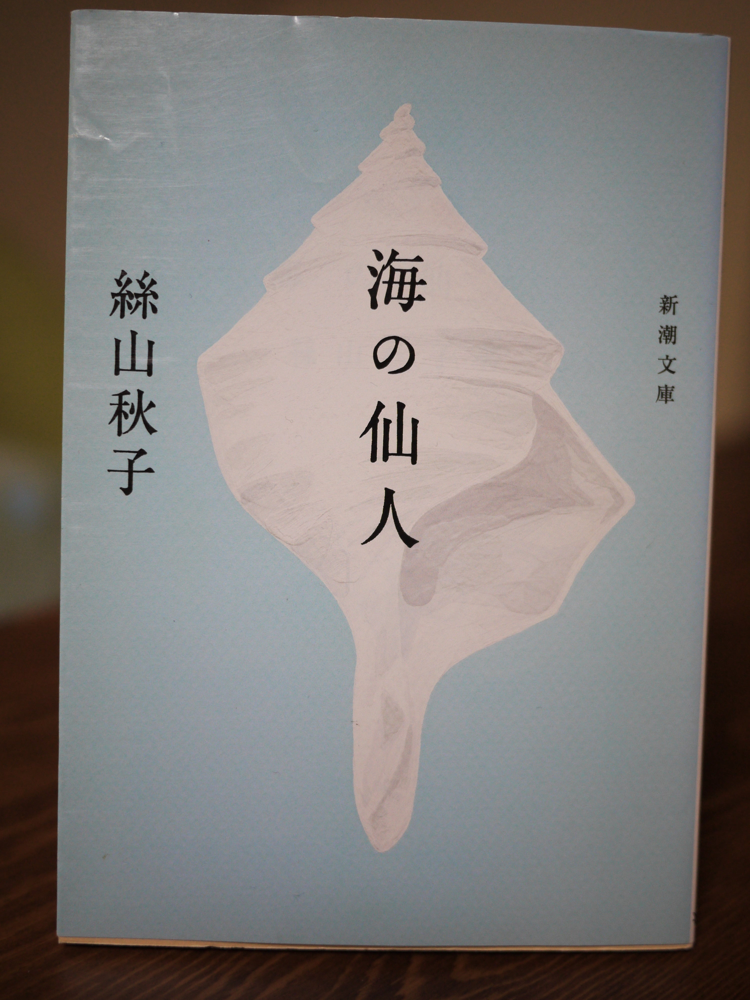
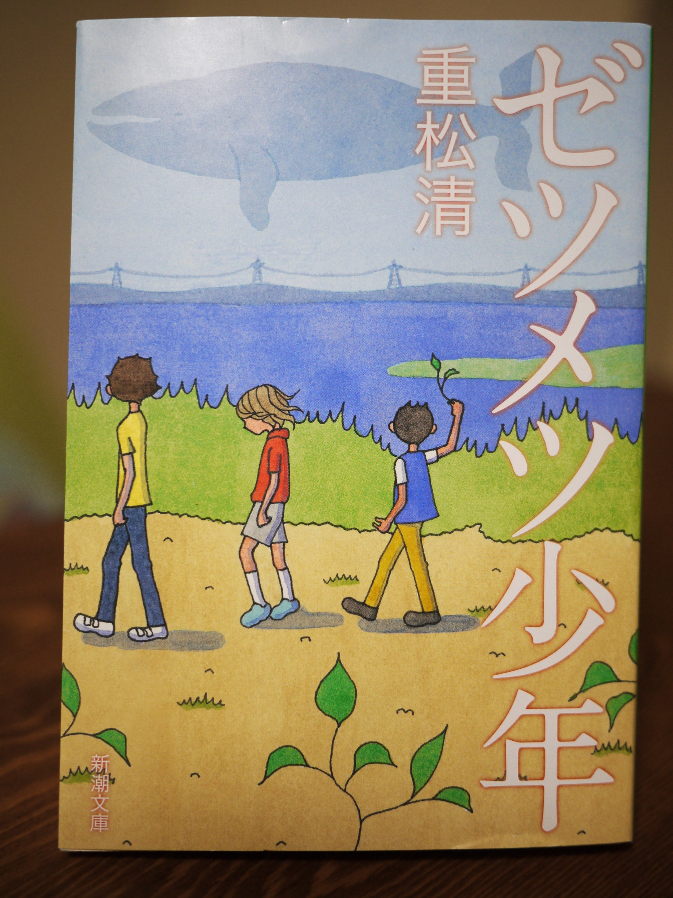

<figure>

</figure>

　北海道砂川「いわた書店」さんで話題になった一万円選書。自分もいつか申し込んでみたいと思いつつなかなか実行に移せずにいます。  
　そこで「いわた書店」さんにはいつかお願いするとして、今回は自分で1万円分の本を買ってみようという企画です。方向性としては、①自分の好きなエンタメ/ミステリーに偏らない ②単行本を選ぶと冊数が少なくなるのでなるべく文庫で ③あまり作家さんが重複しないように という感じで買ってみました。その数全16冊！  
　実は一万円ちょっと超えているんだけど、『ガールズ・ブルー』『海の仙人』『ミュージック・ブレス・ユー！！』の4冊は見つからなくてブックオフで買ったのでだいたい一万円です。  
　では、以下選書の紹介です。まだ全然読んでないのでデータベース等から引用したあらすじ紹介のみで。

### あさのあつこ『ガールズ・ブルー I・II』

　落ちこぼれ高校に通う理穂、美咲、如月。十七歳の誕生日を目前に理穂は失恋。身体が弱く入院を繰り返す美咲は同情されるのが大嫌い。如月は天才野球選手の兄・睦月と何かと比較される。でもお構いなしに、それぞれの夏は輝いていた。葛藤しながら自分自身を受け入れ愛する心が眩しい、切なくて透明な青春群像小説。

<figure>

</figure>

### 池澤夏樹『スティル・ライフ』

　しなやかな感性と端正な成熟が生み出した唯一無二の世界。生きることにほんの少し惑うとき、何度でもひもときたい永遠の青春小説。芥川賞受賞作品。

<figure>

</figure>

### 絲山秋子『海の仙人』

　宝くじに当った河野は会社を辞めて、碧い海が美しい敦賀に引越した。何もしないひっそりした生活。そこへ居候を志願する、役立たずの神様・ファンタジーが訪れて、奇妙な同居が始まる。孤独の殻にこもる河野には、二人の女性が想いを寄せていた。かりんはセックスレスの関係を受け容れ、元同僚の片桐は片想いを続けている。芥川賞作家が絶妙な語り口で描く、哀しく美しい孤独の三重奏。

<figure>

</figure>

### 円城塔『文字渦』

　「昔、文字は本当に生きていたのじゃないかと思わないかい」。始皇帝の陵墓づくりに始まり、道教、仏教、分子生物学、情報科学を縦横に、変化を続ける「文字」を主役として繰り広げられる連作集。文字同士を闘わせる言語遊戯に隠された謎、連続殺「字」事件の奇妙な結末、本文から脱出して短編間を渡り歩くルビの旅……。小説の新たな地平を拓いた12編、川端康成文学賞・日本 SF 大賞受賞。

<figure>

</figure>

### 小川洋子『シュガータイム』

　三週間ほど前から、わたしは奇妙な日記をつけ始めた―。春の訪れとともにはじまり、秋の淡い陽射しのなかで終わった、わたしたちのシュガータイム。青春最後の日々を流れる透明な時間を描く、芥川賞作家の初めての長篇小説。

<figure>

</figure>

### 小野寺史宜『ひと』

　母が急死し、たった１人になった２０歳の柏木聖輔。空腹に負けて吸い寄せられた商店街の惣菜屋で、聖輔は買おうとしていた最後に残った５０円のコロッケを見知らぬお婆さんに譲った。それが運命を変えるとも知らずに…。

<figure>

</figure>

### 北村薫『空飛ぶ馬』

　「私たちの日常にひそむささいだけれど不可思議な謎のなかに、貴重な人生の輝きや生きてゆくことの哀しみが隠されていることを教えてくれる」と宮部みゆきが絶賛する通り、これは本格推理の面白さと小説の醍醐味とがきわめて幸福な結婚をして生まれ出た作品である。異才・北村薫のデビュー作。

<figure>

</figure>

### 重松清『ゼツメツ少年』

　「僕たちはこのままじゃ、ゼツメツしてしまいます」小説家のセンセイのもとに、一通の手紙が届いた。手紙の送り主である中学二年生のタケシ、そして小学五年生の男子リュウと女子のジュン。学校や家で居場所を失くしてしまった三人を救うために、センセイはある隠れ場所を用意するが――。想像力の奇跡を信じ、悲しみの先にある光を求める、驚きと感涙の傑作。毎日出版文化賞受賞。

<figure>

</figure>

### タナ・フレンチ『捜索者』

　アイルランドの小さな村に移住してきた元シカゴ市警刑事・カルは、地元の子どもから、失踪した兄を捜してほしいと頼まれる。誰もが失踪の理由に心当たりがないと話すなか、穏やかに見えた村の暗部がカルを脅かしていく…。

<figure>

</figure>

### 津村記久子『ミュージック・ブレス・ユー！！』

　オケタニアザミは「音楽について考えることは、将来について考えることよりずっと大事」な高校３年生。髪は赤く染め、目にはメガネ、歯にはカラフルな矯正器。数学が苦手で追試や補講の連続、進路は何一つ決まらないぐだぐだの日常を支えるのは、パンクロックだった！超低空飛行でとにかくイケてない、でも振り返ってみればいとおしい日々。野間文芸新人賞受賞、青春小説の新たな金字塔として絶賛された名作がついに文庫化。

<figure>

</figure>

### 中島敦『文字禍・牛人』

　古代アッシリヤの大王は、図書館に出没すると噂される「文字の霊」について老博士に調査を命じる。ある日、ひとつの文字を終日凝視していると、いつしかその文字が解体し…。「文字禍」をはじめ、「狐憑」など全６篇を収録。

<figure>

</figure>

### 三浦しをん『格闘する者に○』

　これからどうやって生きていこう? マイペースに過ごす女子大生可南子にしのびよる苛酷な就職戦線。漫画大好き→漫画雑誌の編集者になれたら……。いざ、活動を始めてみると思いもよらぬ世間の荒波が次々と襲いかかってくる。連戦連敗、いまだ内定ゼロ。呑気な友人たち、ワケありの家族、年の離れた書道家との恋。格闘する青春の日々を妄想力全開で描く、才気あふれる小説デビュー作。

<figure>

</figure>

### 三浦しをん『光』

　島で暮らす中学生の信之は、同級生の美花と付き合っている。ある日、島を大災害が襲い、信之と美花、幼なじみの輔、そして数人の大人だけが生き残る。島での最後の夜、信之は美花を守るため、ある罪を犯し、それは二人だけの秘密になった。それから二十年。妻子とともに暮らしている信之の前に輔が現れ、過去の事件の真相を仄めかす。信之は、美花を再び守ろうとするが―。渾身の長編小説。

<figure>

</figure>

### 道尾秀介『向日葵の咲かない夏』

　夏休みを迎える終業式の日。先生に頼まれ、欠席した級友の家を訪れた。きい、きい。妙な音が聞こえる。Ｓ君は首を吊って死んでいた。だがその衝撃もつかの間、彼の死体は忽然と消えてしまう。一週間後、Ｓ君はあるものに姿を変えて現れた。「僕は殺されたんだ」と訴えながら。僕は妹のミカと、彼の無念を晴らすため、事件を追いはじめた。あなたの目の前に広がる、もう一つの夏休み。

<figure>

</figure>

### 皆川博子『死の泉』

　第二次大戦末期、ナチの施設〈レーベンスボルン〉の産院に端を発し、戦後の復讐劇へと発展する絢爛たる物語。去勢歌手、古城に眠る名画、人体実験など、さまざまな題材が織りなす美と悪と愛の黙示録。1997年の「週刊文春ミステリー・ベスト10」の第１位。第32回吉川英治文学賞受賞の奇跡の大作！

<figure>

</figure>
