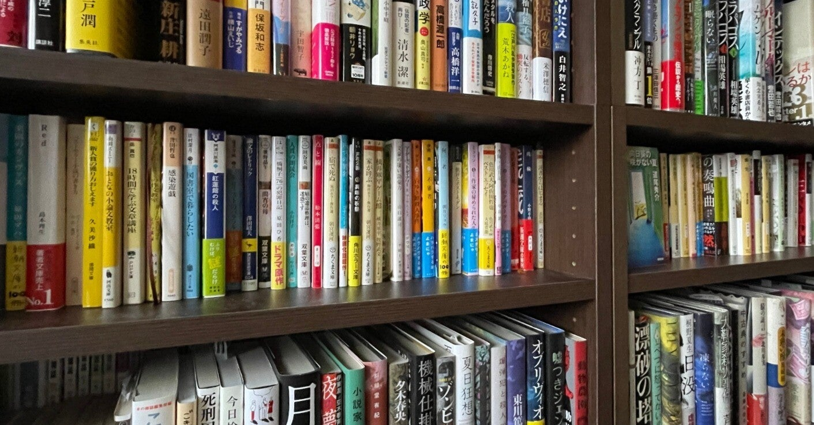
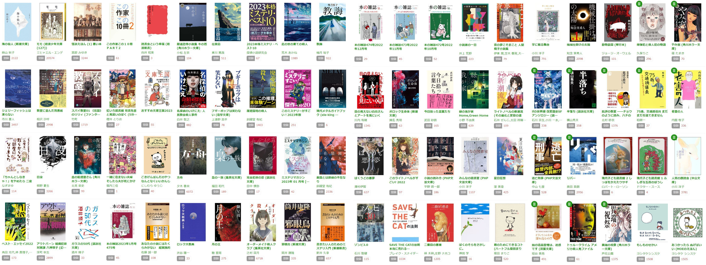
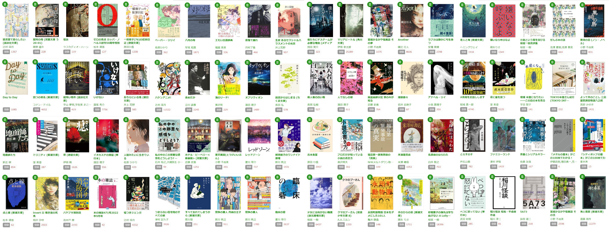
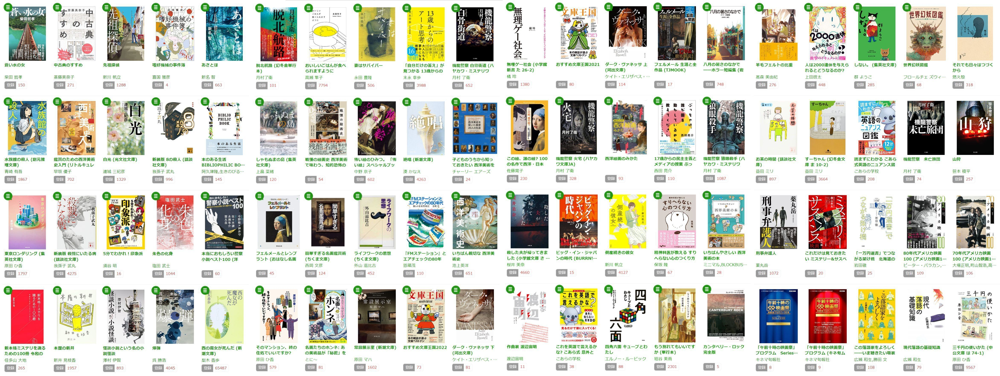
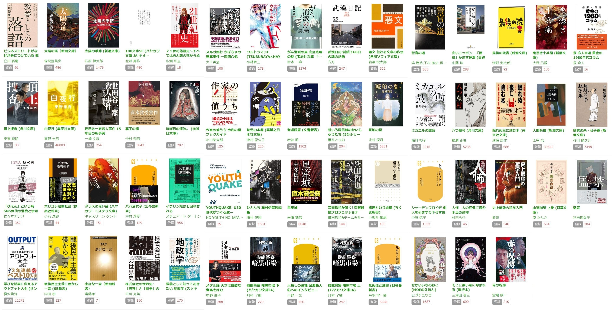

<figure>

</figure>

　今年は結構たくさん読めてよかった。来年もがんばろう。

　以下、印象に残った本10選を書いておく。順不同で順位とかはない。あと、紹介文はツイッターや読書メーターに書いたものまたはそれに書き加えたもの。最後には読んだ本の書影（読書メーター）も掲載。

### 早見和真『八月の母』

　実際の事件をモデルに書かれた小説。二部構成になっており、第一部では事件の中心人物の生い立ちを描き、その人物像をはっきりとさせている。第二部では実際に事件が起きるまでの流れを描いている。地方都市で強いつながりを持たざるをえない人々の病理。長い時間の流れを文章として積み重ねることでその人間関係の濃さと重みを存分に表現している。その上で語られる重大な事件。ぐいぐいと引き込まれる展開で一気に読ませる力強い作品。

[https://honto.jp/netstore/pd-book\_31476723.html](https://honto.jp/netstore/pd-book_31476723.html)

### 呉勝浩『爆弾』

　容疑者と警察の尋問による戦い。その緊張感が最高の読み応えを生み出してくれている作品。事件のスケールも大きく、最近こういった大掛かりなミステリ/サスペンス/警察小説を読んでいなかったので大満足。映像化しても楽しそうな作品だ。

[https://honto.jp/netstore/pd-book\_31542648.html](https://honto.jp/netstore/pd-book_31542648.html)

### 奥田英朗『リバー』

　まず容赦ない厚さで嬉しくなってしまう。厚い本は大好きだ。数多くの登場人物の物語を並行して語り、読む者にその着地点をあれこれ想像させるところがすごく楽しい。驚きのどんでん返しはなくとも、そこにいる人間の数だけドラマがある。

[https://honto.jp/netstore/pd-book\_31902552.html](https://honto.jp/netstore/pd-book_31902552.html)

### 夕木春央『方舟』

　クローズドサークルとしては最悪の場所に閉じ込められる被害者たち。終始閉塞感に満ちた設定が見事。300ページと短めの話だがその分人間関係や感情の揺れ動きはできる限り削ぎ落とし、最低限の情報で構成された緊張感溢れる展開。どんでん返し好きに読んでほしい一冊。

[https://honto.jp/netstore/pd-book\_31871749.html](https://honto.jp/netstore/pd-book_31871749.html)

### 高瀬隼子『おいしいごはんが食べられますように』

　軽妙で、かつ人の心を鮮明に表現する文章が上手い。そう思って読んでいたら芥川賞候補作だった。ハッピーエンドでもバッドエンドでもない微妙な味わいのストーリーに、現代社会と若い人たちのリアルを感じられる。瑞々しい感覚の作家である。

[https://honto.jp/netstore/pd-book\_31533845.html](https://honto.jp/netstore/pd-book_31533845.html)

### 澤村伊智『ばくうどの悪夢』

　久々の比嘉姉妹シリーズで嬉しい。姉妹の境遇も変わっていてそういうところ了解済みで読むのが楽しい。そしていつもどおりシャレにならない怪異と恐怖と退治するのだが、今回は構成が凝っていてこれまた一筋縄ではいかないのであった。澤村伊智は『怪談小説という名の小説怪談』もよかった。

[https://honto.jp/netstore/pd-book\_31956421.html](https://honto.jp/netstore/pd-book_31956421.html)

### 新名智『あさとほ』

　『虚魚』でデビューした作家の第二作。今作では失われた古典を探し求めて怪異に出会う物語。デビュー作と同様、謎を追求していく過程が魅力的で、そこに触れてはいけないものの存在を感じる。静かに語られる恐怖がいい作品だ。

[https://honto.jp/netstore/pd-book\_31658096.html](https://honto.jp/netstore/pd-book_31658096.html)

### 窪美澄『夏日狂想』

　一人の女性が波乱の生涯を通して作家になっていく物語。安定を求めて生きるより自分の豊かな感性に従って生きる主人公に迸る熱量を感じる。経験を重ねることで人間の生き様には重みが出てくるのかもしれない。そんなことを思わせる作品だった。

[https://honto.jp/netstore/pd-book\_31869652.html](https://honto.jp/netstore/pd-book_31869652.html)

### 宮部みゆき『よって件のごとし 三島屋変調百物語八之続』

　作者自らゾンビ話をようやく書けたと言及していた表題作お目当てに初めて読んだシリーズ。事件の広がり方から登場人物の役割まで、本当にゾンビ映画を模したかのようなつくりに嬉しくなってしまう。

[https://honto.jp/netstore/pd-book\_31737756.html](https://honto.jp/netstore/pd-book_31737756.html)

### 遠田潤子『人でなしの櫻』

　病を抱えた主人公の画家。その主人公を勘当した稀代の料理人である父親の死。あまりに激しい人間関係のもと、父親の抱えた闇に向き合おうとしながらも、それを絵として残す欲求に抗えない主人公。劇薬のような設定が盛りだくさんなのだが、それをねじ伏せる表現力とストーリー展開で最後まで読ませる激動の一冊。重厚かつ読む者の胸に深く切り込んでくる作品だ。遠田潤子は**『イオカステの揺籃』**もよかった。

[https://honto.jp/netstore/pd-book\_31533843.html](https://honto.jp/netstore/pd-book_31533843.html)

　他にも、カルト教団の恐ろしさを書いた**芦花公園『とらすの子』**、同じくカルト教団に探偵が挑む**白井智之『名探偵のいけにえ』**、ファミリーパーティでの緊張感が秀逸な**綿矢りさ『嫌いなら呼ぶなよ』**、トリックの種明かしに驚かされる**結城真一郎『＃真相をお話しします』**、 神保町の古書店へのロマンと当地のグルメが楽しい**原田ひ香『古本食堂』**、楽器をストイックに演奏することの美しさに触れられる**安壇美緒『ラブカは静かに弓を持つ』**、端正な文章でファンタジックな情景が浮かび上がる**小川洋子『掌に眠る舞台』**、由緒正しい新本格的ミステリーの**東川篤哉『仕掛島』**などもよかった。いやー他にも色々紹介したい！

### 読んだ本の書影

<figure>

</figure>

<figure>

</figure>

<figure>

</figure>

<figure>

</figure>
