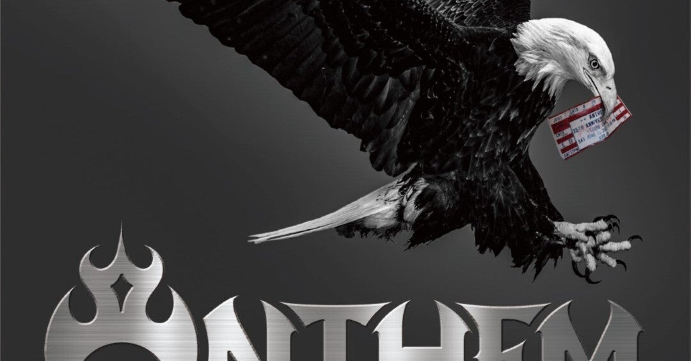

<figure>

</figure>

　もう8月も半ばになったというのに今頃今年の上半期に聞いた音楽から10枚選んでみた。

### Beyond The Black / Beyond The Black

セルフタイトルのアルバム。曲もこなれてきて自由自在な感じがする。

[https://open.spotify.com/intl-ja/album/0tdRNZ2Rb53OoY6CioMdZy?si=fqEskajlTH6PHBYTHnTrZg](https://open.spotify.com/intl-ja/album/0tdRNZ2Rb53OoY6CioMdZy?si=fqEskajlTH6PHBYTHnTrZg)

### RUSH! / Maneskin

今作もマネスキンらしいサウンドに仕上がってる。

[https://open.spotify.com/intl-ja/album/2KUaR4K36tSliwAoUA1gcs?si=AfyI6hz0SmKldl7YEJE8HQ](https://open.spotify.com/intl-ja/album/2KUaR4K36tSliwAoUA1gcs?si=AfyI6hz0SmKldl7YEJE8HQ)

### Foregone / In Flames

原点回帰などと言われているが、むしろ幅広い表現に挑戦している。

[https://open.spotify.com/intl-ja/album/1IqQ6UX3hzJLVXtRmui4w3?si=QLCY-aVPT5-ulwxxEX7luA](https://open.spotify.com/intl-ja/album/1IqQ6UX3hzJLVXtRmui4w3?si=QLCY-aVPT5-ulwxxEX7luA)

### Judgement Day / LOVEBITES

新ベースのFami。を迎えてのニューアルバム。疾走するパワーメタルがいい。

[https://open.spotify.com/intl-ja/album/4Bka88VXkTbGuSKGMSrPmg?si=hwKEzGNPQ-iYwkAKrSyr6A](https://open.spotify.com/intl-ja/album/4Bka88VXkTbGuSKGMSrPmg?si=hwKEzGNPQ-iYwkAKrSyr6A)

### Call of the North / Frozen Crown

ファビオラ“シーナ”ベロッモ加入してから断然応援したくなってるバンド😆ギターも上手くなってるよね。

[https://open.spotify.com/intl-ja/album/7dEkeKhigZx7MkLCGziA9J?si=--KKIjEmSGiH5fydTnGA3w](https://open.spotify.com/intl-ja/album/7dEkeKhigZx7MkLCGziA9J?si=--KKIjEmSGiH5fydTnGA3w)

### The Awakening / KAMELOT

より構築美を全面に打ち出して聴きごたえある。

[https://open.spotify.com/intl-ja/album/5K86UoosKOH0pJTOworeHY?si=6vSsHlPATfiAMxCrk-T6vA](https://open.spotify.com/intl-ja/album/5K86UoosKOH0pJTOworeHY?si=6vSsHlPATfiAMxCrk-T6vA)

### On the Prowl / Steel Panther

80年代オリエンテッドは健在。心地よく聞けるサウンドだ。

[https://open.spotify.com/intl-ja/album/383qQlo1eU1IRqgQysnMx5?si=SGQKcFsKTauUtYAHSuSjrA](https://open.spotify.com/intl-ja/album/383qQlo1eU1IRqgQysnMx5?si=SGQKcFsKTauUtYAHSuSjrA)

### 72 Seasons / METALLICA

バラエティに富んでいながらメタル的にかっこいいのがさすがなのだ。

[https://open.spotify.com/intl-ja/album/6UwjRSX9RQyNgJ3LwYhr9i?si=2aJ0ZB06S1GaRw1W7cdkbQ](https://open.spotify.com/intl-ja/album/6UwjRSX9RQyNgJ3LwYhr9i?si=2aJ0ZB06S1GaRw1W7cdkbQ)

### Seven / WINGER

実力のあるバンドだから時代を超えても上質なアルバムが出てきて頼もしい。

[https://open.spotify.com/intl-ja/album/0nKamkddw6cAKzErCJtSHR?si=eiNOPi6jRYGt3qQ6OoAYVw](https://open.spotify.com/intl-ja/album/0nKamkddw6cAKzErCJtSHR?si=eiNOPi6jRYGt3qQ6OoAYVw)

### Nostalgia / ENFORCER

相変わらずいい感じにオールドスクール。こういうサウンドを維持してほしいバンド。

[https://open.spotify.com/intl-ja/album/6fK73XeJneVXkMMuYHLXJG?si=G6Lrwh0hQx2D0LeamL0huQ](https://open.spotify.com/intl-ja/album/6fK73XeJneVXkMMuYHLXJG?si=G6Lrwh0hQx2D0LeamL0huQ)

### CRIMSON & JET BLACK / ANTHEM

今のところ今年のベストアルバム。パワー,スピード＆メロディが素晴らしい。

[https://open.spotify.com/intl-ja/album/4n4gxvWmj9v3DbiGgGebqa?si=fJ3Qa50CTJSk296aIiF6FA](https://open.spotify.com/intl-ja/album/4n4gxvWmj9v3DbiGgGebqa?si=fJ3Qa50CTJSk296aIiF6FA)

下半期突入したけど、これからもどんどんメタルを聞いていきます！😆

###
