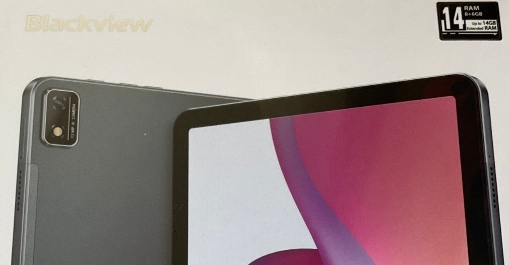
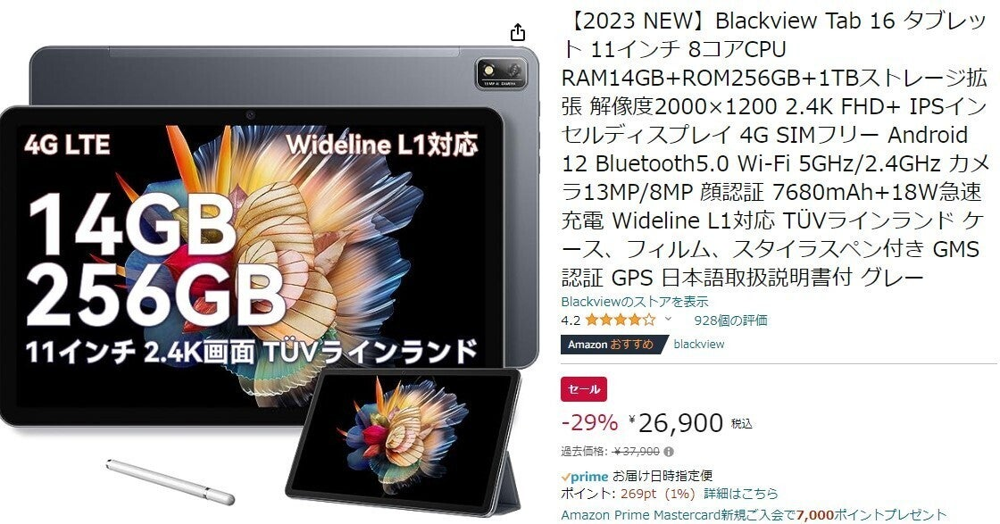
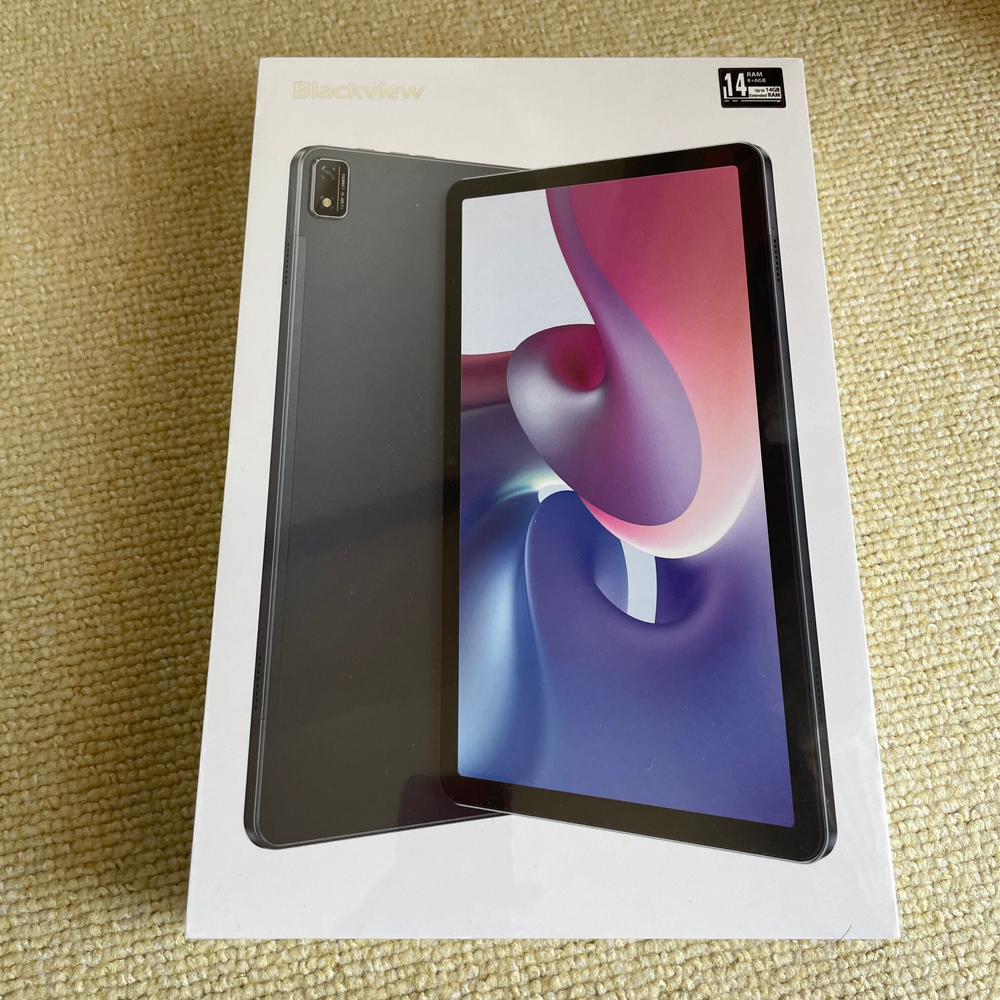
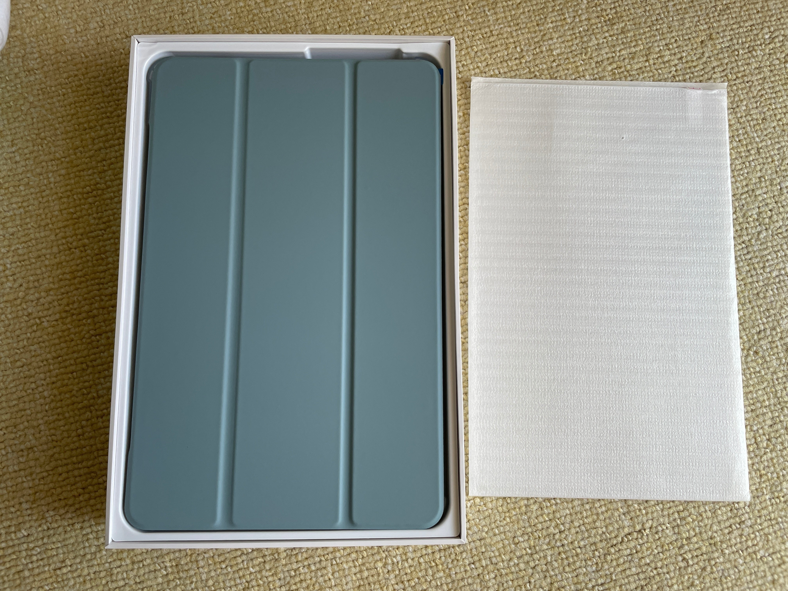
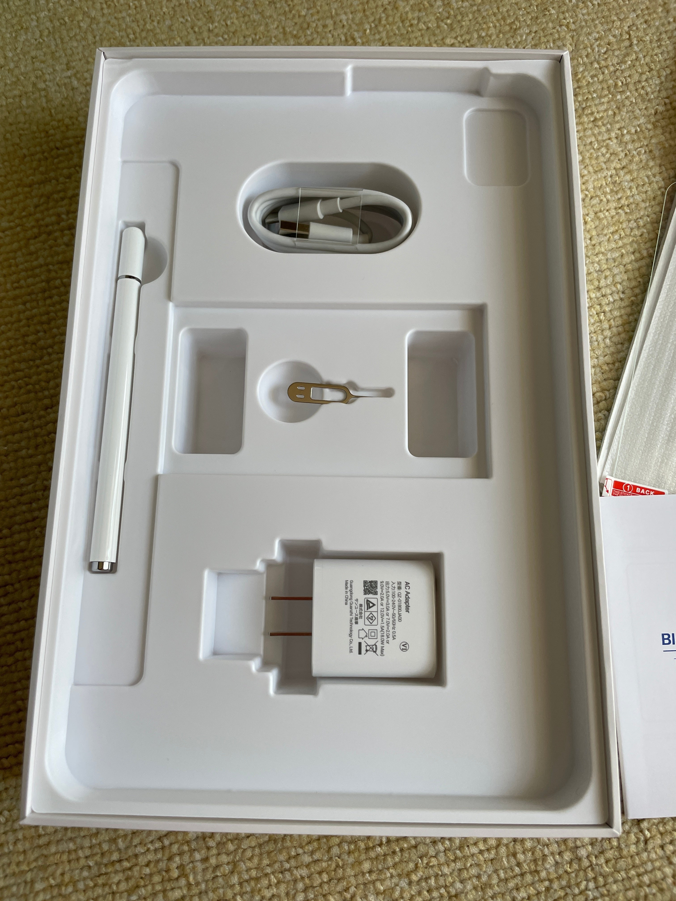
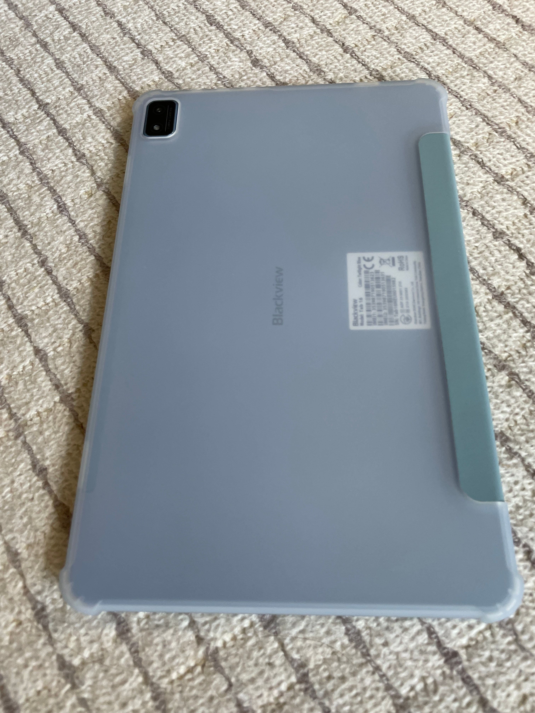
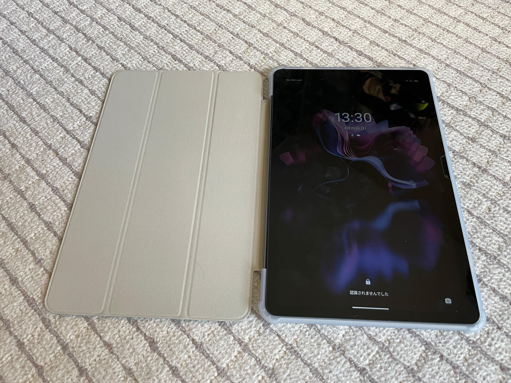

<figure>

</figure>

　僕が第2世代のiPad Pro 12.9インチを買ったのが2018年5月。すでにカバーはボロボロ。最近はなぜかwifiの速度が怪しい（ときどき通信が途切れる？）ような状態。そろそろ新しいモデルが欲しい時期だぞと思っていた。

　しかし、現行のiPad Proで12.9インチを買うと最低でも17万円程度。普段雑誌や大判の本を読むのと、ネットフリックス見るだけのタブレットにこの価格はちょっと躊躇してしまう。

　そんなわけで、12.9インチという大きさはムリだけど、なるべく大きくてやすいタブレットを物色していた。

　まあ、いろいろ候補はあったんだけど、Widevine L1対応（ネットフリックスがFHD画質で見れる）で大きめのタブレットということでBlackviewというタブレットを選んでみた。ちょうど今（23年8月19日現在）Amazonで29%オフで26,900円。iPadに比べたら驚くほど安い。画面サイズは11インチだ。[公式サイトもある。](https://jp.blackview.hk/)  
[Amazonの販売ページはこちら。](https://www.amazon.co.jp/NEW%E3%80%91Blackview-%E8%A7%A3%E5%83%8F%E5%BA%A62000%C3%971200-IPS%E3%82%A4%E3%83%B3%E3%82%BB%E3%83%AB%E3%83%87%E3%82%A3%E3%82%B9%E3%83%97%E3%83%AC%E3%82%A4-Bluetooth5-0-Wi-Fi2-4GHz/dp/B0BVZFN2TN?th=1)（←アフィリエイトではありません）

<figure>

<figcaption>

公式よりAmazonの方が安い

</figcaption>

</figure>

　今や中華タブレットもおしゃれなパッケージングで、ぶっちゃけアップルのものまねなんだけど、それでもこういう製品を売り出せるメーカーが次々に出てくるのはすごいと思う。

<figure>

<figcaption>

箱が完全にアップルのものまね

</figcaption>

</figure>

　箱を開けると、なんとカバーがついた状態で本体が収まっている。

<figure>

<figcaption>

箱を開けた状態

</figcaption>

</figure>

　素晴らしいことにこのタブレット、本体だけでなく、シリコンケース、カバー、ガラスフィルム、ペンなどがすべてセットになっているのだ。

<figure>

<figcaption>

ペンやアダプタも入ってる

</figcaption>

</figure>

　アップル製品では必要に応じて結構なお値段のオプション品を買わなければならなかったりするので、こういう売り方は嬉しいところ。

<figure>

<figcaption>

シリコンケースも最初から装着されてる

</figcaption>

</figure>

　Androidタブレットを買うのは、2012年10月に買ったNexus7以来ということで、久々なのだが、まあ本読んだり映画見るのに困ることはないでしょう。

<figure>

<figcaption>

充電も100%でした

</figcaption>

</figure>

　そんなわけで、アメリカの物価高や円安が続くようなら、こういう選択肢もありだなという話でした。
