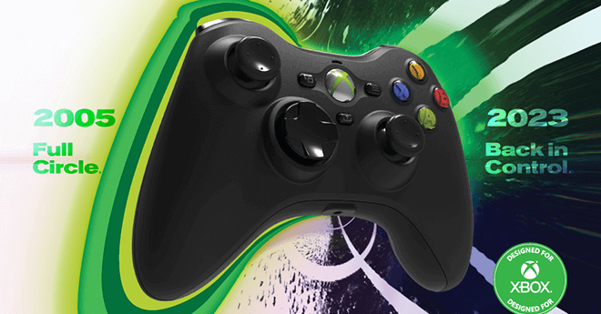
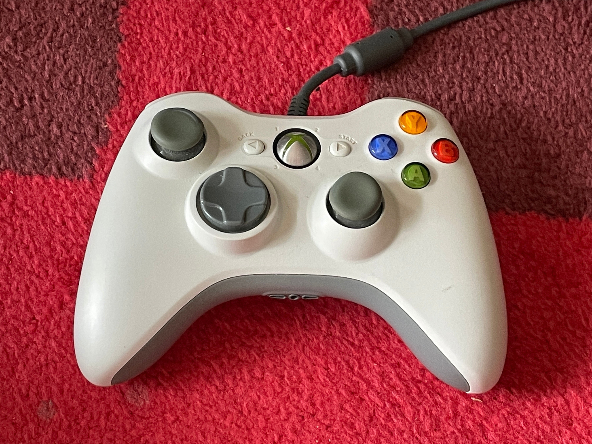
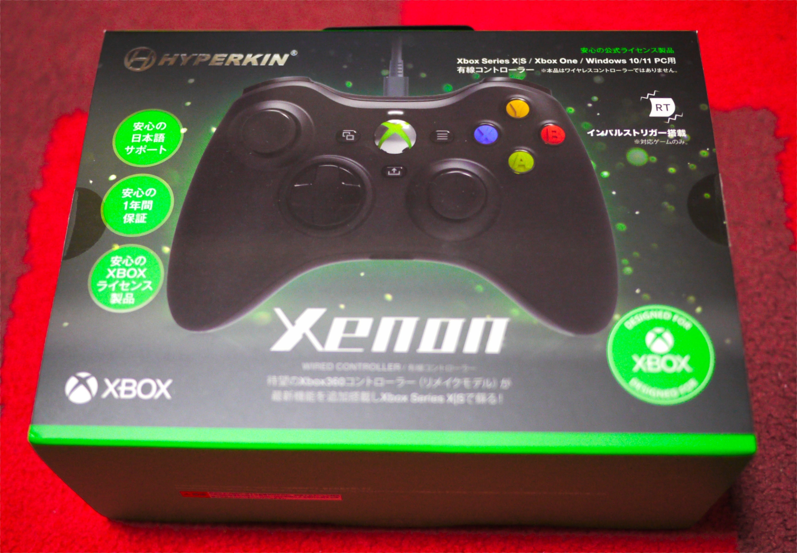
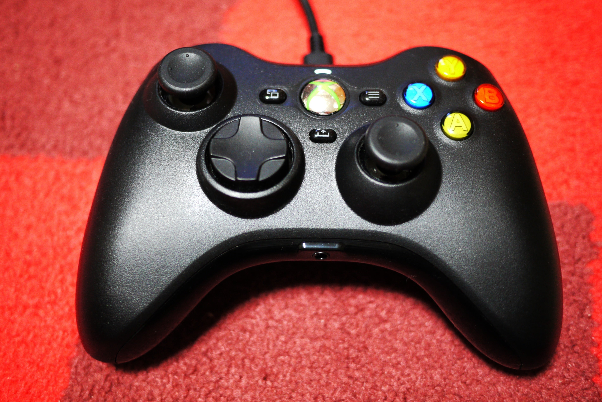
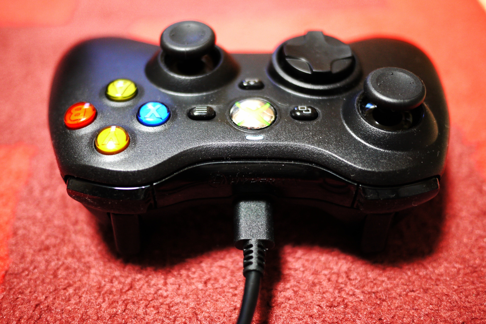
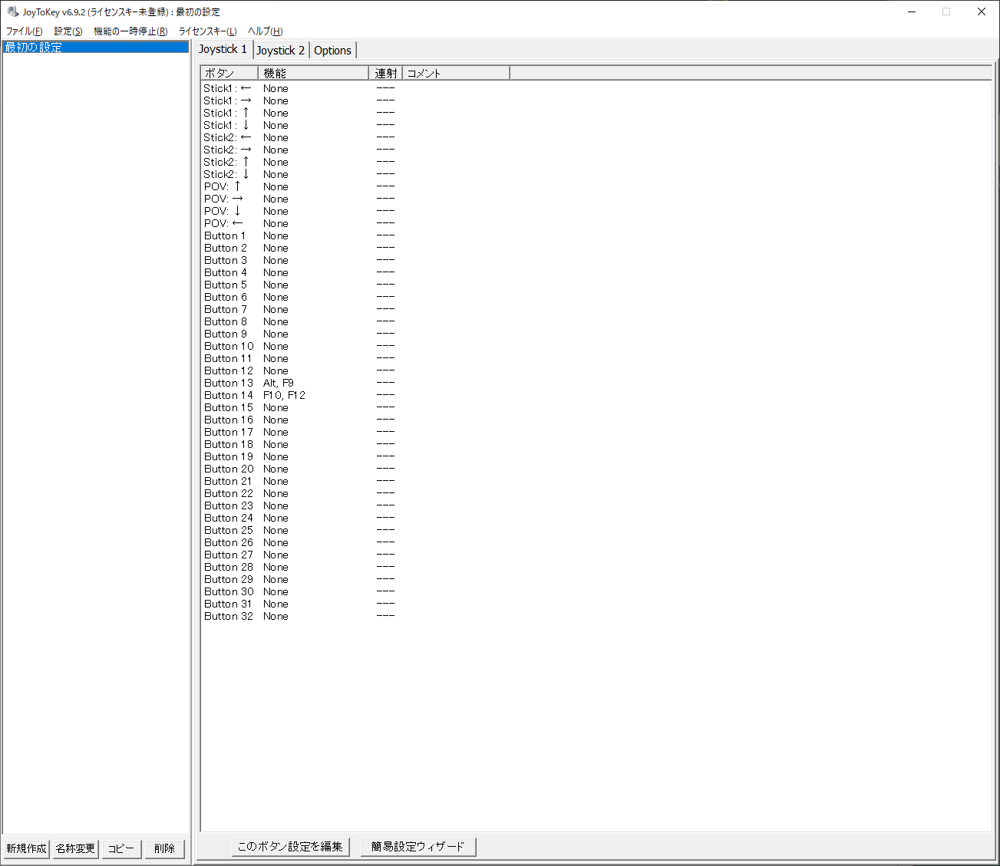

<figure>

</figure>

　これまでPCゲームのコントローラーは主にXbox360の有線コントローラーを使っていました。

<figure>

</figure>

　今回、それをHYPERKIN Xenonに替えてみました。Xbox360コントローラーもLB辺りが怪しくなっていたので、そろそろ交換時期かなと思っていたのです。

<figure>

</figure>

　昨今はコントローラーも高額化していて、簡単に買い換えられないという実情がありますが、その割にコントローラー自体の耐久性はあまり信頼できないという悲しい状況。  
　このXenonはAmazonで3400円とおよそ半額になっていたのでゲットしました。安いときに買い置きしておけという人もいますが、こういう商品はいずれプラ部分等が劣化し、電子部品もどれだけ保つかわからないので一期一会の精神でひとつしか買いません。かつてマイクロソフトのトラックボールを買いだめている人を見ましたが、ああいう真似はちょっとできませんね。

<figure>

</figure>

　Xenonの本体は極めてXbox360コントローラーに近いです。大きさも同じぐらいで、手に持ったフィット感が最高ですね。何と言ってもXbox360コントローラーは20年近く愛用してきたのでもはや体の一部。それと同じ手触りのコントローラーが手に入るのは僥倖です。  
　アナログスティックはXbox360コントローラーより軽快で、特にアナログスティックを頻繁に使う3Dゲームではより快適な操作感を得られます。これは嬉しいところ。

<figure>

</figure>

　PCとの接続はUSB-Cのケーブルで行う有線コントローラーです。以前は無線のコントローラーも使っていたのですが、ゲーム中に接続が切れることもあり、最近はもっぱら有線コントローラーを使っています。ケーブルが汎用のUSBケーブルというのも嬉しいですね。付属のケーブルは3m程度の長さがあるので、僕のようにリビングに大型モニターを置いて、その下にPCをセットしているような環境でも余裕の配線環境が可能です。

<figure>

</figure>

　なお、このコントローラーには、最新XboxシリーズのShareボタンも装備されているため、早速それをキャプチャボタンとして利用することにしました。  
　ただし、steamではこのボタンに対応していないため（対応方法があるかもしれない？）、JoyToKeyを使ってShareボタンにGeforce Experienceとsteamのスクリーンショットを割り当て、同時にスクショが撮れるようにしました。なにげに便利です。  
　ついでに、しいたけボタンはPCで使用しないので、こちらは動画録画のボタンにしてみました。ゲーム中にコントローラーから手を離さずに録画の開始／終了ができるので快適です。

　今回は安く売っていたので安価に入手できたHYPERKIN Xenonですが、今こういうお安いコントローラーを求めているゲーマーは多いんじゃないでしょうか。これからも同じような製品がずっと出続けてくれることを願っています。
