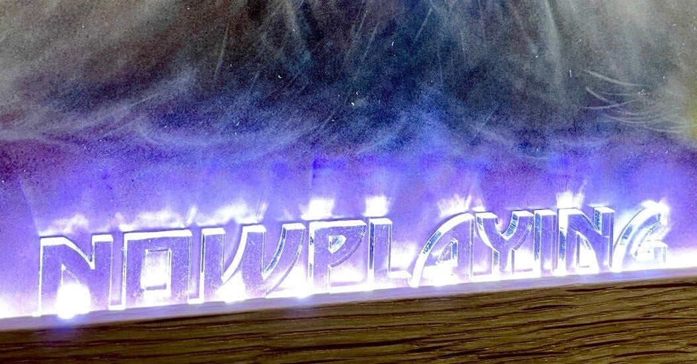
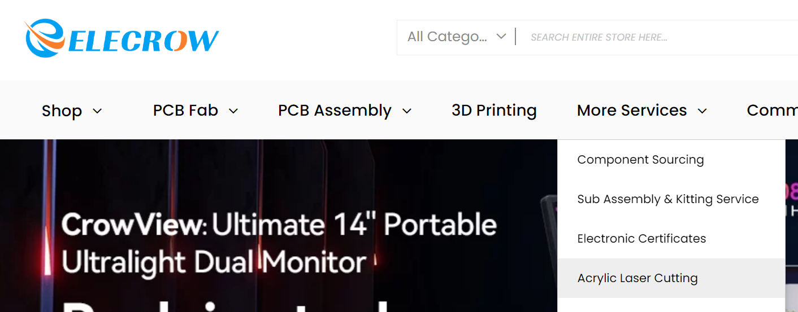
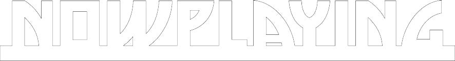
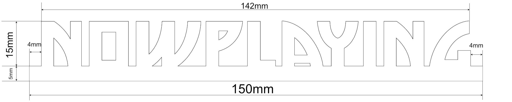
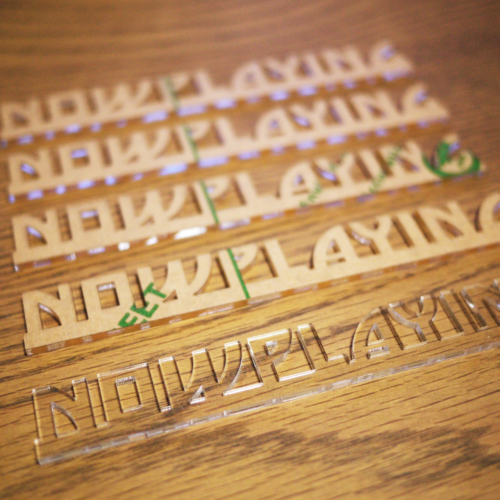
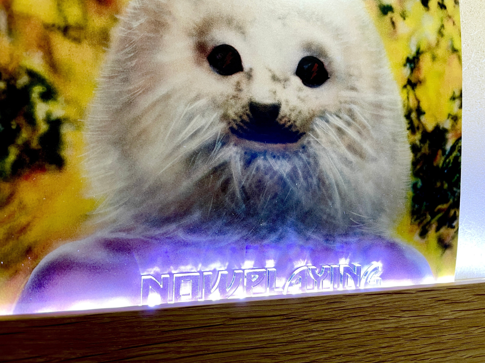

<figure>

</figure>

　基板自作派の人にはおなじみの[深圳Elecrow](https://www.elecrow.com/)に、アクリル板のカット加工を頼んでみた。

<figure>

<figcaption>

More ServicesからAcrylic Laser Cuttingを選択

</figcaption>

</figure>

　初めてなので、15mm×5mmの一番安いサイズで試してみることにした。最低枚数は5枚から。厚さ3mmにしたらなんと本体1ドル。送料込みで10ドルぐらい。安いなあ。

<figure>

</figure>

　データはpdf等で送れるので、Affinity Photoで簡単に作ってpdfでエクスポート。すぐに送ってみた。ところがここから結構ハマることに。  
　まず、最初のデータはpdfの形式がおかしいということで、dxfで送れないかという返事が来た。Affinity Photoがdxfで出力できないので、pdfを変換してみる。  
　今度は向こうで読めたらしいが、パスの閉じていないところがあったり、アンチエイリアスの画像を変換することで線が二重化されたりしていたようだ。これで3回ほどメールのやり取りをすることになってしまう。  
　Illustratorがあるとベクターデータでdxfに出力できそうなのだが、とりあえず持っていないので、最後はAfiinity Designerの体験版を使ってデータを作り直した。Designerもそのうち買ったほうがよさそう。  
　で、結局Affinity Designerでエクスポートしたpdfデータが受け付けられたわけだが、最後にサイズがわからないから教えてくれ、というメールが返ってきた。

<figure>

</figure>

　そんなわけで、上の画像はAffinity Photoで寸法を書き入れたjpg画像。これも一緒に送ったら、やっと、じゃあこれで作るから！との返事。一安心。

<figure>

</figure>

　なんとそのやり取りから2日後には製品が届いた。早くてびっくり。加工の精度もなかなかよくて満足。何より1ドルのために何回も丁寧なメールのやり取りをしてくれるElecrowすごいな。深圳の企業は仕事に余裕があるのだろうか。素晴らしい。

<figure>

</figure>

　早速テープLEDで下から照らして光らせてみた。ちょっとサイズが小さかったので、そのうちもっと大きなサイズで注文し直す予定。  
　あと、テープLEDの明るさが微妙なので、こちらも色／明るさが制御可能なLEDに変更しましょう。
