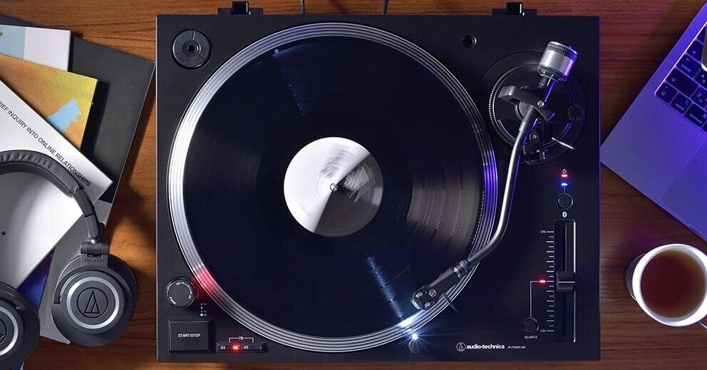
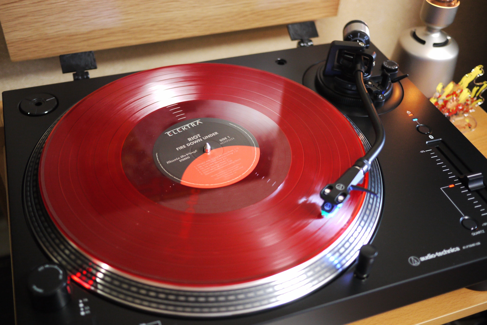
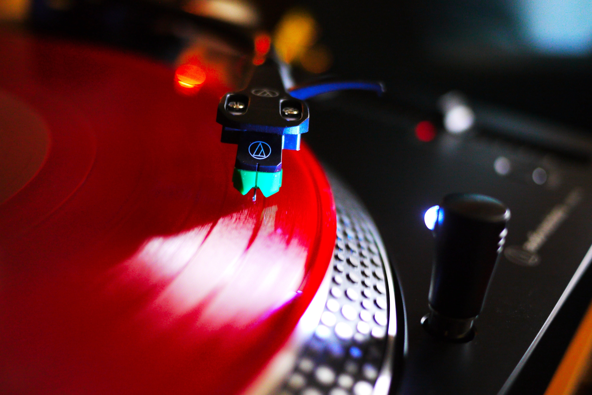
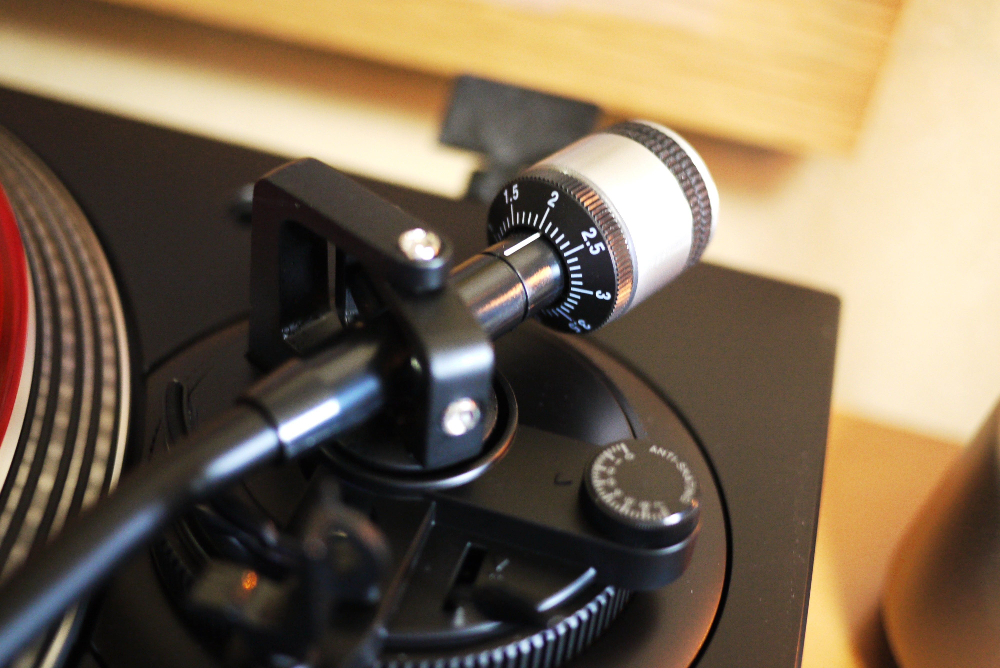
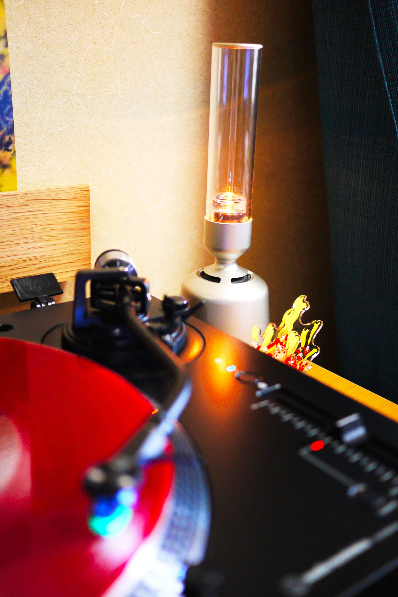

<figure>

</figure>

　昨年はオーディオテクニカのサウンドバーガーを買った。

[https://note.com/keigox68000/n/n9eead6a01e36](https://note.com/keigox68000/n/n9eead6a01e36)

　これは自分で買ったレコードプレーヤーの3台目になるのだが、これがきっかけでまたレコードを買うようになった。病膏肓に入ると言うのか、レコードを買うことが呼び水になり、また新しくプレーヤーを買ってしまった。

　新機種はオーディオテクニカのAT-LP120XBT-USBである。ダイレクトドライブでBluetooth対応の機種だ。

<figure>

</figure>

　これがBluetooth対応のくせにフルオートではなく、針を下ろすところから再生が終了して針を上げるところまで自分でやらなければならないフル手動。針の位置がよく分かるように照らしてくれるLED付き。なんとも趣味的な機種だ。

<figure>

</figure>

　カートリッジによってバランス調整するプレーヤーは昭和以来使ったことがありません。

<figure>

</figure>

　毎日レコード聞いているので、据え置きはやっぱり便利。と言ったところで、スピーカーが相変わらずソニーのグラスサウンドスピーカーなので、こちらもそろそろ何とかしたいところ。

<figure>

</figure>

　あと、ラックもホームセンターで買ってきた組み合わせて簡単に棚が作れる木材で作ったものなので、こちらもそのうちしっかりしたものを自作したい感じかな。
