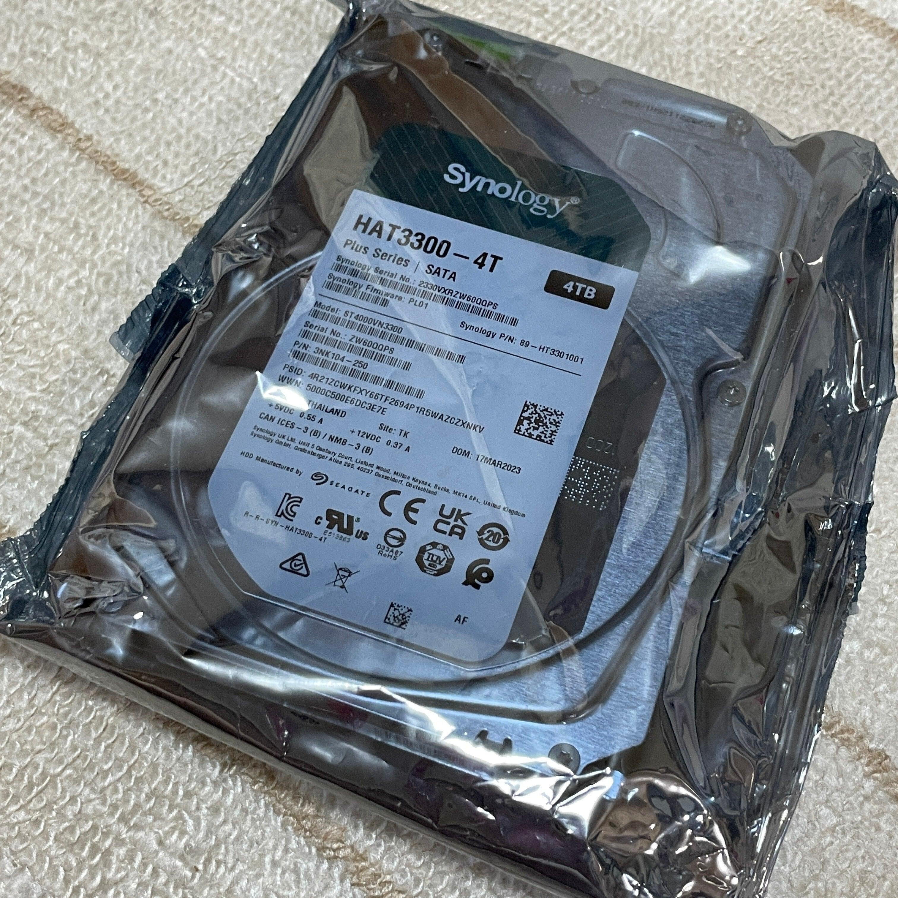
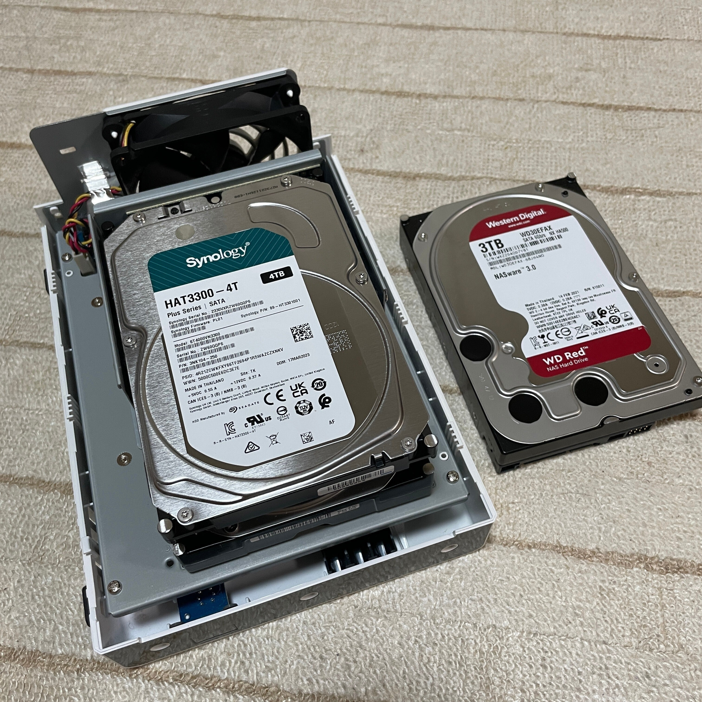

<figure>

</figure>

　2年前に買ったNASだが、その後半年ほどして片方のHDDでエラーが頻発するようになった。  
　セクター不良ということなのでかなり怖いのだが、一応フォーマットし直すと収まるのでそれで使っていた。しかしその後も3回ほどセクター不良を繰り返すのでいよいよ交換に踏み切った次第である。

[https://note.com/keigox68000/n/n74783d2b62c4](https://note.com/keigox68000/n/n74783d2b62c4)

　前回は対応外のHDDを使っていたので、今回は対応しているHDDを買ってみた。値段は15000円ぐらい。そんなに変わらないみたいだ。  
　今は3TBを2台内蔵しているので、今度は4TBにした。

<figure>

</figure>

　内部にアクセスするのは極めて簡単。ただし、どちらがディスク１でどちらがディスク２か間違えないように注意。

<figure>

</figure>

　というわけで、写真上側のディスク１がセクタ不良でエラーを吐いているので交換。

<figure>

</figure>

　HDD入れ替えて電源を入れると、自動で修復が始まる。ディスク２から復元して約半日～１日程度で元に戻る。簡単だ。

　ただし、今回は3TB + 4TBという組み合わせなので、当然3TBの容量しかない。もう片方は予算の都合で来月交換。

　とか言ってたら、たった１ヶ月でHDDの価格が1000円上がってしまった。これだけの短期間に7%値上がりって大きいなあ。
