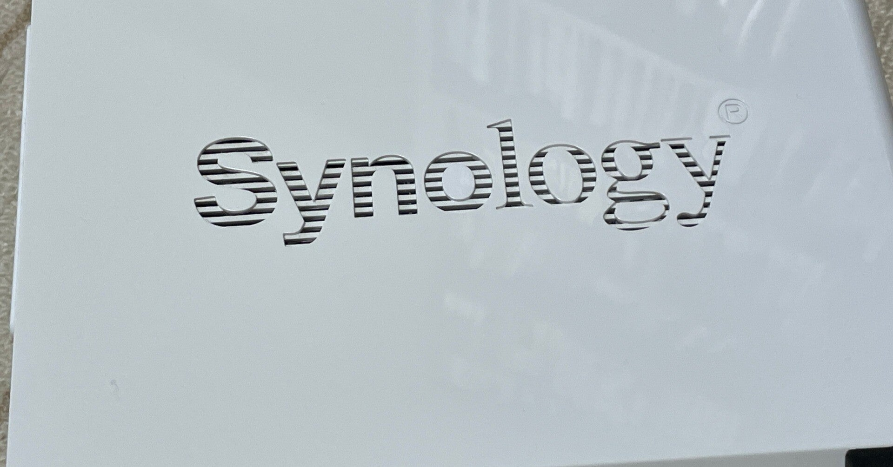
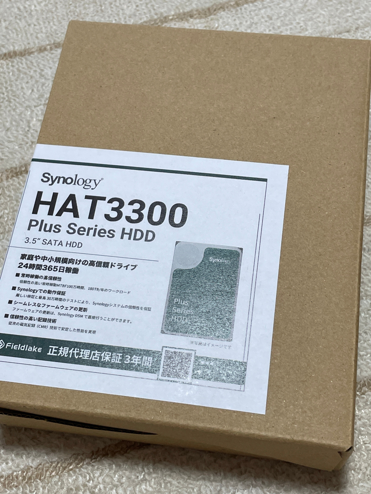
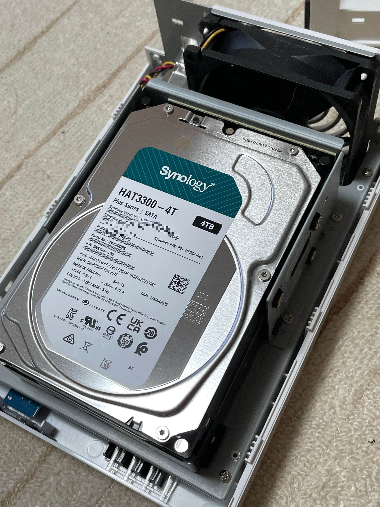
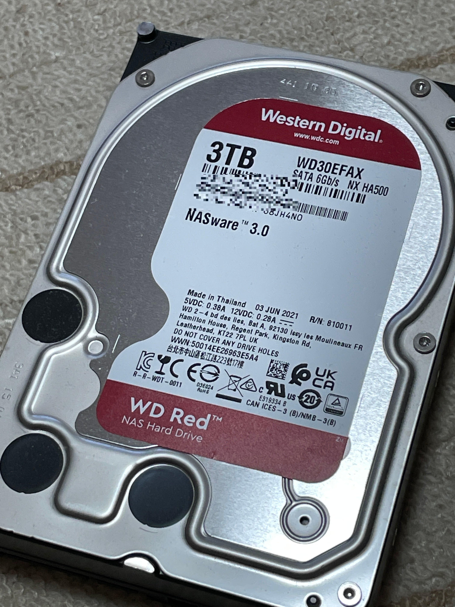

<figure>

</figure>

　先日HDDを交換したNAS。２台のHDDが、それぞれ3TBと4TBで無駄が出るため、不良でないHDDも4TBのものに交換することにした。

[https://note.com/keigox68000/n/nbfc6e24c2a9f](https://note.com/keigox68000/n/nbfc6e24c2a9f)

　前回と同じHDDを時期をずらして買ってみた。同じロットを避けるためである。

<figure>

</figure>

　写真では分からないが、今回は下のディスク２を交換した。

<figure>

</figure>

　これでNASにアクセスし、ディスクの修復を選んでやると、また半日～１日程度で復旧する。  
　取り外したHDDはまた何かに使うことにしよう。

<figure>

</figure>

　ところで、このNASには外付けHDDを接続してバックアップを取っている。このHDDが3TBなので、それもそのうち不足するだろう。それはまた足りなくなったときに考える。
