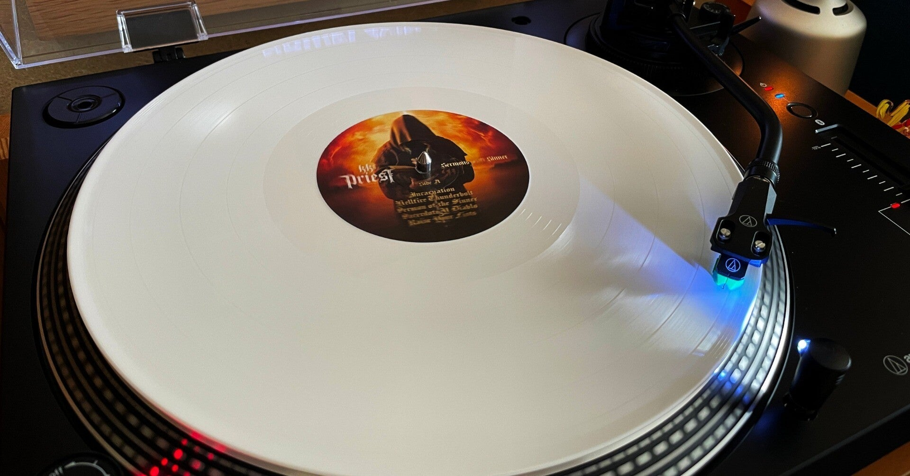
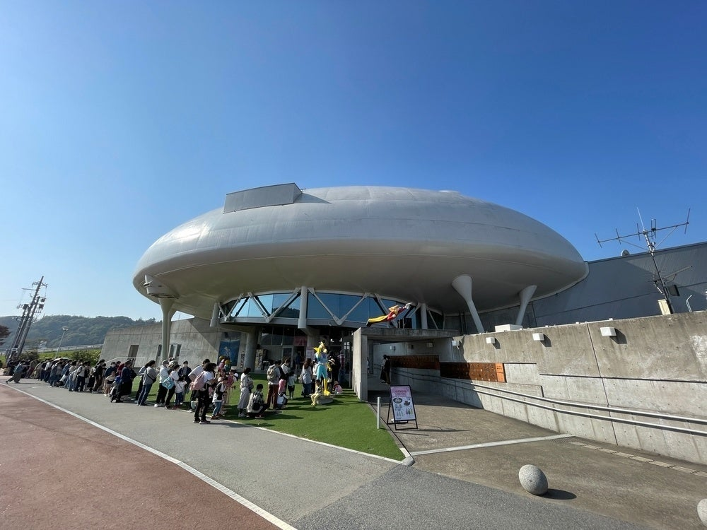
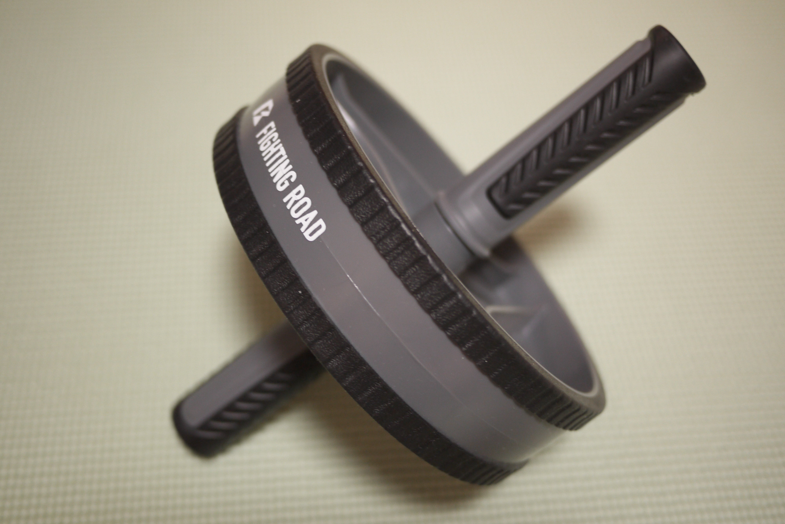
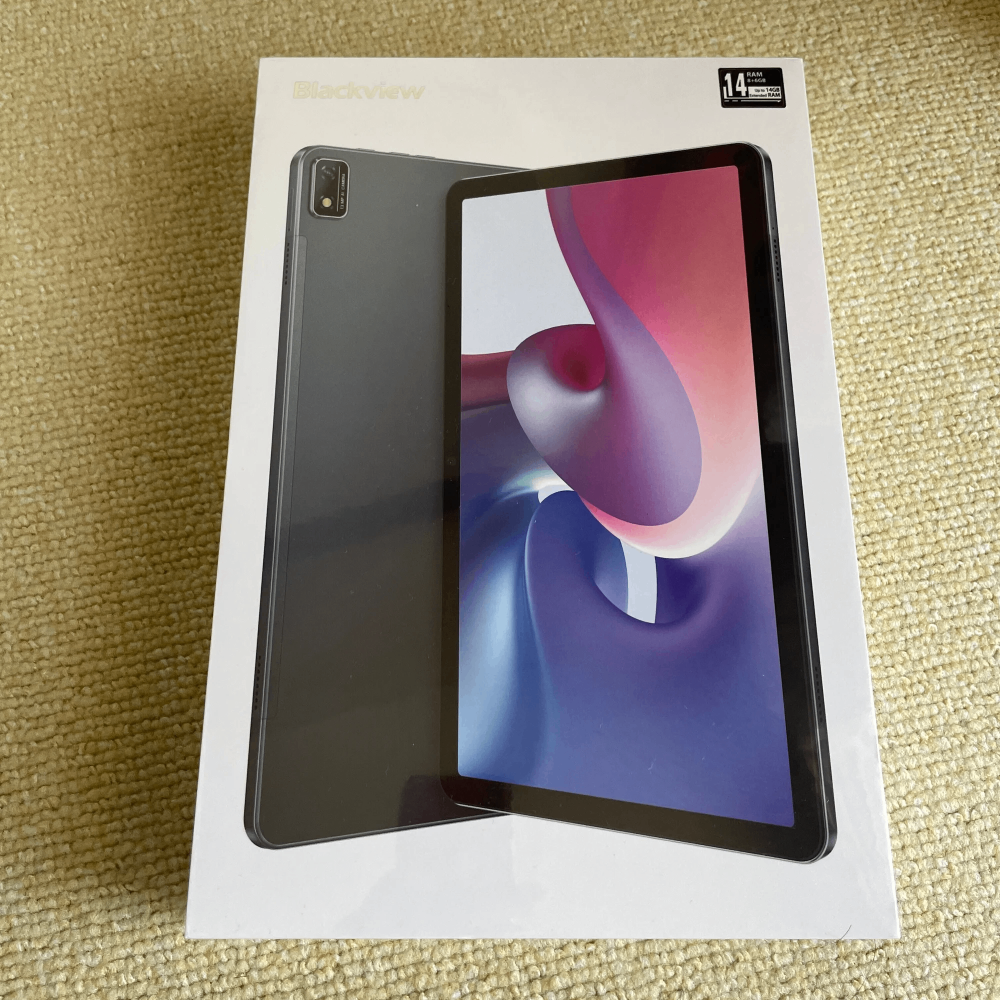
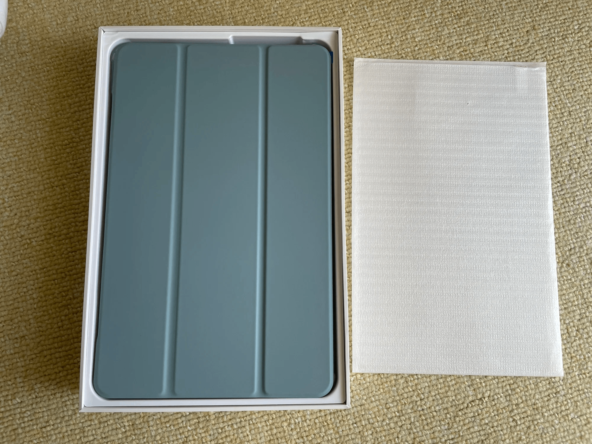
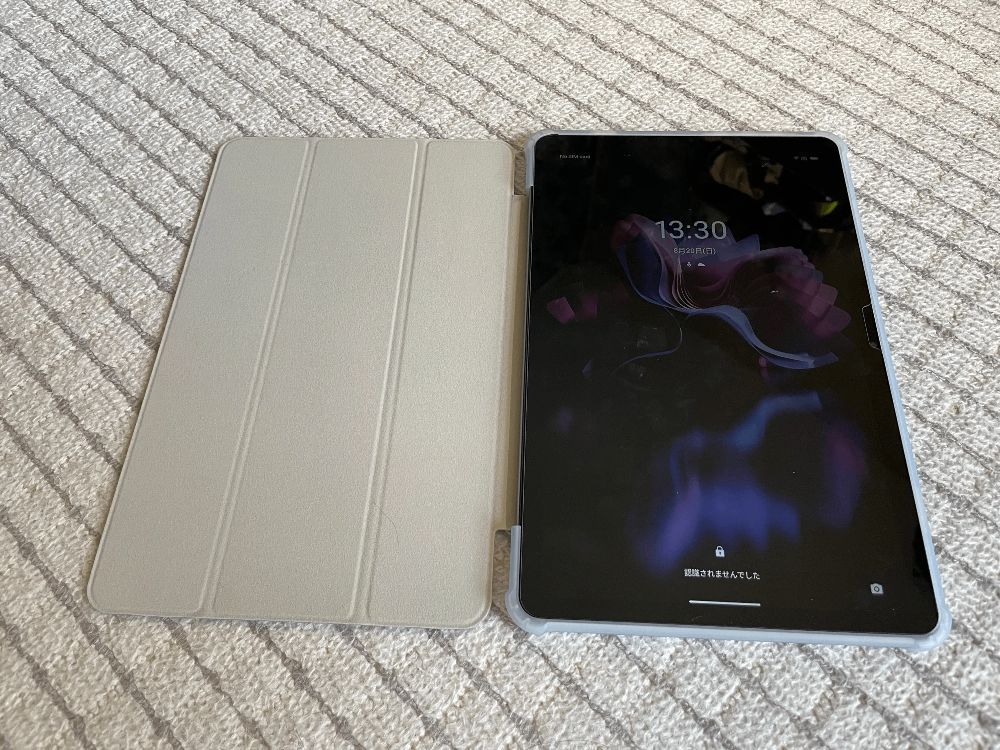
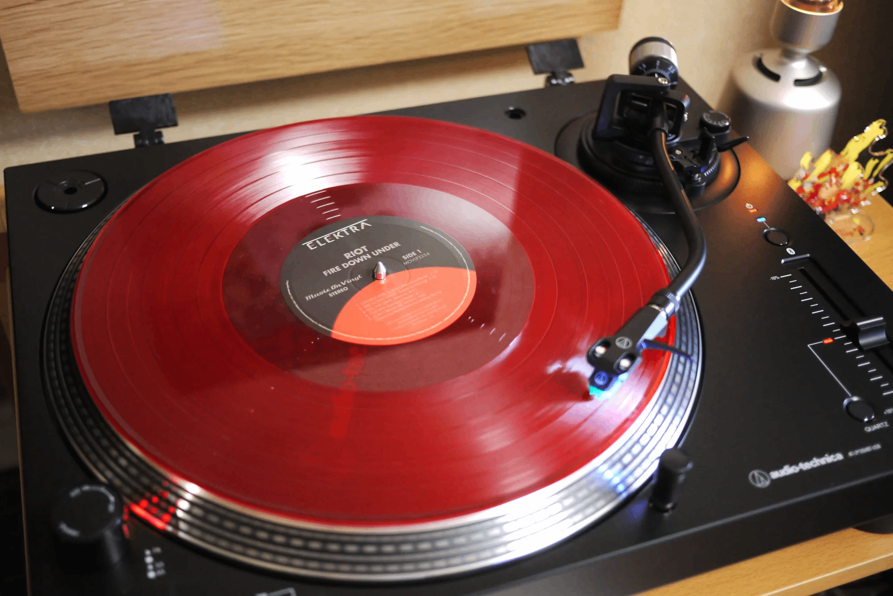
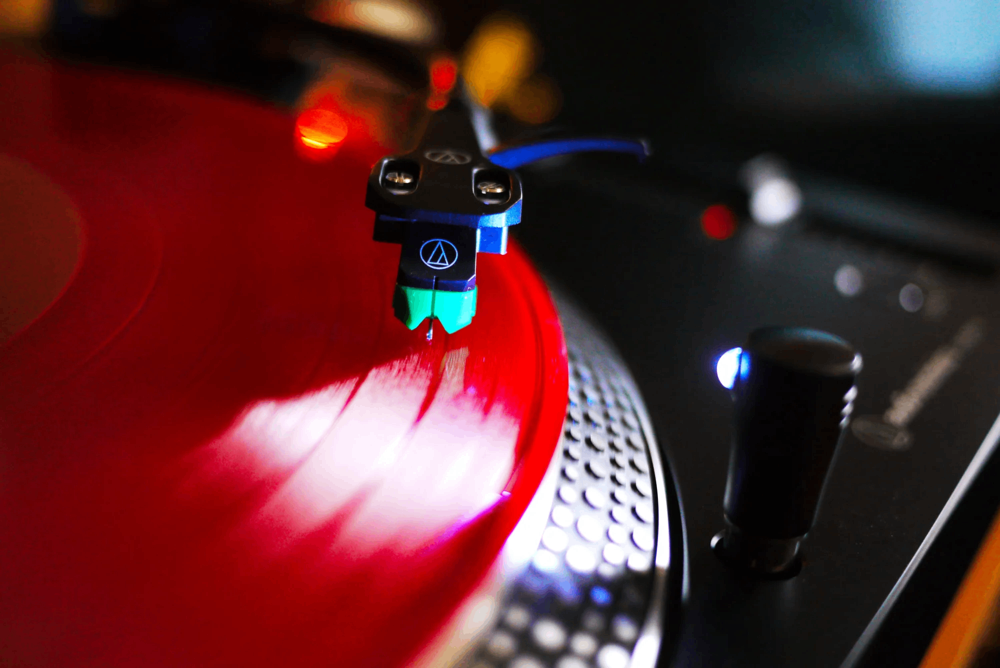
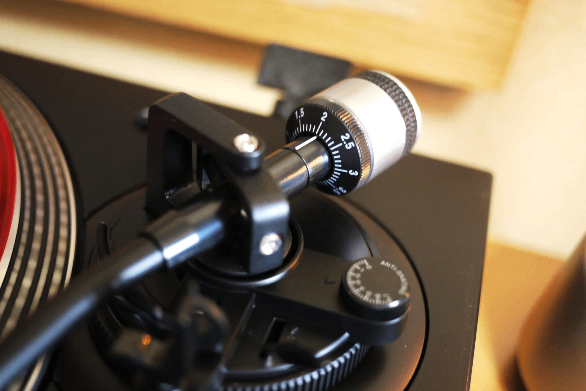

<figure>

</figure>

　今年も買ってよかったものまとめてみましょう。もうあまり欲しいものもない感じで、同時に老後に備えて余計なものも買わないようにしているので驚くようなものもないのですが。

　ちなみに去年の記事はこちら。

[https://note.com/keigox68000/n/n9eead6a01e36](https://note.com/keigox68000/n/n9eead6a01e36)

### 第３位　かえるのピクルス サイボーグ009コラボぬいぐるみ他

　宮城県石巻市にある「石ノ森章太郎萬画館」で、『かえるのピクルス』と『サイボーグ009』のコラボ企画でグッズが販売されるということで、11月頭の連休で突貫的に1000km走って行ってきました。

<figure>

</figure>

　おなじみサイボーグ戦士の赤いユニフォーム仕様のかえるです。

<figure>

</figure>

　それから、自分もサイボーグ戦士のような顔をしているイラストのアクリルスタンドです。遠出の旅行は久々だったのでそれも込みでいい買い物でした。

<figure>

</figure>

### 第３位　腹筋ローラー

　同率第３位ってことでもうひとつ。６月ぐらいから筋トレも始めて、ジムに通わず家で筋トレするために腹筋ローラーを買いました。  
　見た目簡単な道具ですが、これがなかなか筋肉に負荷をかけてくれてよいのです。BMIも22まで落ちたし、腹筋も割れてきたし、こちらもいい買い物でした。

<figure>

</figure>

### 第２位　Blackview Tab 16

　５年間使ったiPad Proのバッテリーがダメになったものの、今やPCみたいな価格になってしまった現行iPad Proを買う気にもなれず買ったアンドロイドタブレットです。

<figure>

</figure>

　夏に買ったときの価格で26,900円。しかも保護フィルムやカバー付きというこれだけ買えばOKなセット。今はもう少し安いみたい。  
　ちなみにWidevine L1で、動画サイトなどのフルHDやそれ以上の動画に対応しているところも選んだポイントですね。

<figure>

</figure>

　使っていたiPad Proが13インチで、こちらは11インチなので少し小さめだが、主な利用目的の雑誌等を読む目的にはなんとか足りている感じ。  
　あと、防水ケース買って風呂でも読書、動画視聴、Slay the Spireが遊べるのはよかった。毎日活用しています。

<figure>

</figure>

### 第１位　オーディオテクニカ AT-LP120XBT-USB

　Bluetooth対応のレコードプレーヤー。ダイレクトドライブ方式。

<figure>

</figure>

　このプレーヤーについては別記事でも触れてみました。

[https://note.com/keigox68000/n/n933eab3d7ea8](https://note.com/keigox68000/n/n933eab3d7ea8)

　とにかく全部マニュアル操作で面倒なところがいい。レコード聞くってそういうことだよねって満足できます。

<figure>

</figure>

　スピーカーは相変わらず、ソニーのグラスサウンドスピーカーLSPX-S2を使っているので、こちらもいずれアップグレードしたいところですね。

<figure>

</figure>

　グラスサウンドスピーカーの話題はこちらです。

[https://note.com/keigox68000/n/nb7a6ad12a5b5](https://note.com/keigox68000/n/nb7a6ad12a5b5)

　そんなわけで、2023年の買ったよかったものでした。来年もいいもの買うよ！
