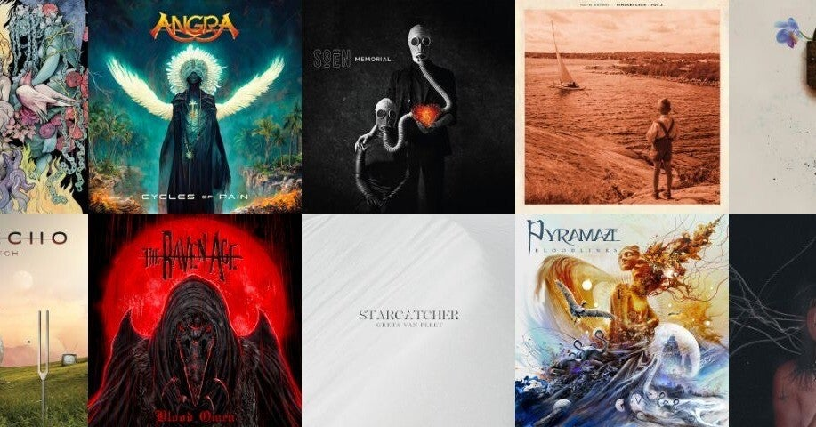

<figure>

</figure>

今年下半期のベスト10を選んでみた。上半期は以下の記事でどうぞ。

[https://note.com/keigox68000/n/n028da21b8305](https://note.com/keigox68000/n/n028da21b8305)

### A Call To The Void / Hot Milk

男女ツインヴォーカルで幅広い音楽性。いきなり来日してこれから人気出そう。

[https://open.spotify.com/intl-ja/album/3I9vXpqnMZMt70mYpAb1Me?si=Dvmc9wzpSUaXEJGHCd6fWw](https://open.spotify.com/intl-ja/album/3I9vXpqnMZMt70mYpAb1Me?si=Dvmc9wzpSUaXEJGHCd6fWw)

### Stone / Baroness

複雑な曲展開でありながらメタリックなサウンドを失わないスタイルがクール。

[https://open.spotify.com/intl-ja/album/67ClCmoQ6gef3cH9Axho6g?si=5h3moJuNSOGjSPVnOeBviw](https://open.spotify.com/intl-ja/album/67ClCmoQ6gef3cH9Axho6g?si=5h3moJuNSOGjSPVnOeBviw)

### Final Pitch / Arch Echo

希望に満ちたメロディが心地よいプログレッシブなメタル。2曲めはジョーダン・ルーデス参加。タイトル曲は初のヴォーカル曲。

[https://open.spotify.com/intl-ja/album/217M34Xe0aUx5grF0Uqr65?si=z7CZ5WYOTCSxtSXkWRsxlg](https://open.spotify.com/intl-ja/album/217M34Xe0aUx5grF0Uqr65?si=z7CZ5WYOTCSxtSXkWRsxlg)

### Memorial / Soen

スウェーデン発のプログレメタル。ずっと注目してたけどようやく話題を聞くようになってきて嬉しい。

[https://open.spotify.com/intl-ja/album/4Cs8QmnJ9OvUPv6O0Izmnn?si=fqe2qIQbTsySEAG2S0SYTQ](https://open.spotify.com/intl-ja/album/4Cs8QmnJ9OvUPv6O0Izmnn?si=fqe2qIQbTsySEAG2S0SYTQ)

### Blood Omen / The Raven Age

スティーブ・ハリスの息子がギターをプレイしているバンド。親の七光りとかではなく、パワフルでスピード感あふれるオリジナルなメタルでかっこいい。

[https://open.spotify.com/intl-ja/album/7Js6ph0U2lycgwAcA8p02p?si=Z8-psLUFQNGZR1SbrcrsUA](https://open.spotify.com/intl-ja/album/7Js6ph0U2lycgwAcA8p02p?si=Z8-psLUFQNGZR1SbrcrsUA)

### Bloodlines / Pyramaze

プログレッシブな音楽性ながら確固としたメロディで楽曲に魅力があるバンド。ここ数年プログレメタルは本当にレベル高くて嬉しい。

[https://open.spotify.com/intl-ja/album/1cC11XQGnj3XLuLTxoWtRe?si=OGBNO7\_4TRGWQlHs271I5g](https://open.spotify.com/intl-ja/album/1cC11XQGnj3XLuLTxoWtRe?si=OGBNO7_4TRGWQlHs271I5g)

### Life / DGM

イタリアのベテランPROGメタル。その昔北斗の拳とかイングヴェイの曲を（日本向けに）歌っていた頃からすると隔世の感がある上質なアルバム。

[https://open.spotify.com/intl-ja/album/20CbZyxyQ43nmowbgyUbyX?si=ra43F2QiT6uaP7P025-09g](https://open.spotify.com/intl-ja/album/20CbZyxyQ43nmowbgyUbyX?si=ra43F2QiT6uaP7P025-09g)

### Starcatcher / Greta Van Fleet

日本では人気もう一つな印象のバンド。スケールの大きなアルバムコンセプト、実際に聞いて楽しめる楽曲。精神性もプレイももっと評価されていいでしょう。

[https://open.spotify.com/intl-ja/album/7i1NJXQNNFZPyjE0W3GPgE?si=fenMqBiNRkKnnSKmMINRTw](https://open.spotify.com/intl-ja/album/7i1NJXQNNFZPyjE0W3GPgE?si=fenMqBiNRkKnnSKmMINRTw)

### Cycles Of Pain / ANGRA

オリジナルメンバーはギターのラファエル・ビッテンコートのみでもはや原型をとどめていないANGRAだが、そのサウンドは全く衰えることなくパワフル。人材豊富で頼もしい。ファビオ・リオーネのヴォーカルもすごいマッチング率だし、楽曲の完成度も高すぎる。

[https://open.spotify.com/intl-ja/album/3yN1WBLzFEYaGhlm7UrnWA?si=VaDLA8mSRDC2a0V2HcyAXw](https://open.spotify.com/intl-ja/album/3yN1WBLzFEYaGhlm7UrnWA?si=VaDLA8mSRDC2a0V2HcyAXw)

### Himlabacken(Vol.2) / Moon Safari

Moon Safariはシーンからいなくなってしまったのかと思ってたら、素晴らしいアルバムとともに戻ってきました。何者にも左右されない独自のサウンドが素晴らしい。

[https://open.spotify.com/intl-ja/album/2mfyTUrJLUuGE9056jPxgH?si=B0QkdQXCREyiAteiJ4gTQg](https://open.spotify.com/intl-ja/album/2mfyTUrJLUuGE9056jPxgH?si=B0QkdQXCREyiAteiJ4gTQg)

さて、以下は次点。と言っても上記10アルバムに劣るとかじゃなくて、本当は同列で語りたいぐらいのいいアルバムが多かった。

### The Unknown / Evile

絶対90年代のメタリカ好きでしょって言いたいサウンドをベースにしながら、独自のダークさを醸成させてきたバンド。エリラン・カントールによるアートワークもベストマッチ。

[https://open.spotify.com/intl-ja/album/51BpsIsaNfI4MWqUl3WD9P?si=pQkP12DvRNmKgY0q3PwWqw](https://open.spotify.com/intl-ja/album/51BpsIsaNfI4MWqUl3WD9P?si=pQkP12DvRNmKgY0q3PwWqw)

### ROCK ON!!! / 紗良

ヘヴィロックの日本人的独自解釈がかっこよく決まっている。ジャケもいい。

[https://open.spotify.com/intl-ja/album/1rHYKhrtNh20UWE8iRzn5U?si=r-jdtr1BTnWA9v0pR\_ZQgg](https://open.spotify.com/intl-ja/album/1rHYKhrtNh20UWE8iRzn5U?si=r-jdtr1BTnWA9v0pR_ZQgg)

### The Sinner Rides Again / KK's Priest

2ndも元気印。ヤコブ・ハンセンの力でサウンドにまとまりが出てきてよいよい。

[https://open.spotify.com/intl-ja/album/7pYgtfezOV71GntwnAMbjv?si=l8OqfFI2SpiFoHc-92t0CA](https://open.spotify.com/intl-ja/album/7pYgtfezOV71GntwnAMbjv?si=l8OqfFI2SpiFoHc-92t0CA)

### The Legacy Within / CHAOS CONTROL

国産パワーメタル。凝った展開とストレートにかっこいいサウンドのバランスがよい。

[https://open.spotify.com/intl-ja/album/1kVSAucZrzToekBmvEipnm?si=ZjvT4yQlRm-K3puWoWWfcg](https://open.spotify.com/intl-ja/album/1kVSAucZrzToekBmvEipnm?si=ZjvT4yQlRm-K3puWoWWfcg)

### Kings Of The Asylim / Phil Campbell and the Bastard Sons

モーターヘッドのギタリスト父ちゃんとその息子たちのバンド。新ヴォーカルでパワーアップ。もっと評価されてモーターヘッドのあのギターサウンドを絶やさないでもらいたい。

[https://open.spotify.com/intl-ja/album/5bS7Shg3cWC7MTjEWdAPCj?si=fSvlJDdwRxasDEfJ-mPjcg](https://open.spotify.com/intl-ja/album/5bS7Shg3cWC7MTjEWdAPCj?si=fSvlJDdwRxasDEfJ-mPjcg)

### Trinity / Ronnie Atkins

上質なメロディが無限に生まれるんじゃないかという創作意欲がすごい。どこまでも応援し続けたい。

[https://open.spotify.com/intl-ja/album/3E58O5rZKfLyLbw2NmOhR4?si=JRyxu81yRf6QH1wdQy4XjA](https://open.spotify.com/intl-ja/album/3E58O5rZKfLyLbw2NmOhR4?si=JRyxu81yRf6QH1wdQy4XjA)

### Nemesis AD / Serenity

天上の音楽かと思うような大仰な展開が素晴らしい。

[https://open.spotify.com/intl-ja/album/32hgnbaZSZlx7pvRFobyNN?si=Mifoi8kvReK2RDFye4vDJw](https://open.spotify.com/intl-ja/album/32hgnbaZSZlx7pvRFobyNN?si=Mifoi8kvReK2RDFye4vDJw)

### CMF2 / Corey Taylor

ソロアルバムはその引き出しの多さが楽しめてよいよい。これからも定期的にソロやってほしい。

[https://open.spotify.com/intl-ja/album/7uuvUTNqJqEE3gfHU4bXtt?si=FakM7lmWRjifPPdt9DS55Q](https://open.spotify.com/intl-ja/album/7uuvUTNqJqEE3gfHU4bXtt?si=FakM7lmWRjifPPdt9DS55Q)

### The Scheme: 21st Century Revival

これだけゲームミュージック。リアルシンセで蘇る80年代ゲームミュージック。想像よりずっとよかった。

[https://open.spotify.com/intl-ja/album/10othoB05PkKXfDVBlowK8?si=TAvyEPNRT8ODTJtQzq\_VVw](https://open.spotify.com/intl-ja/album/10othoB05PkKXfDVBlowK8?si=TAvyEPNRT8ODTJtQzq_VVw)

ザ・スキームの全曲感想は以下の記事で。

[https://note.com/keigox68000/n/nab3dbb0d1550](https://note.com/keigox68000/n/nab3dbb0d1550)

というわけで、次点の多い下半期アルバムでした😆  
来年もメタル聞くよ！🤘  
あと気が向いたら年間ランキングも書くかも。
